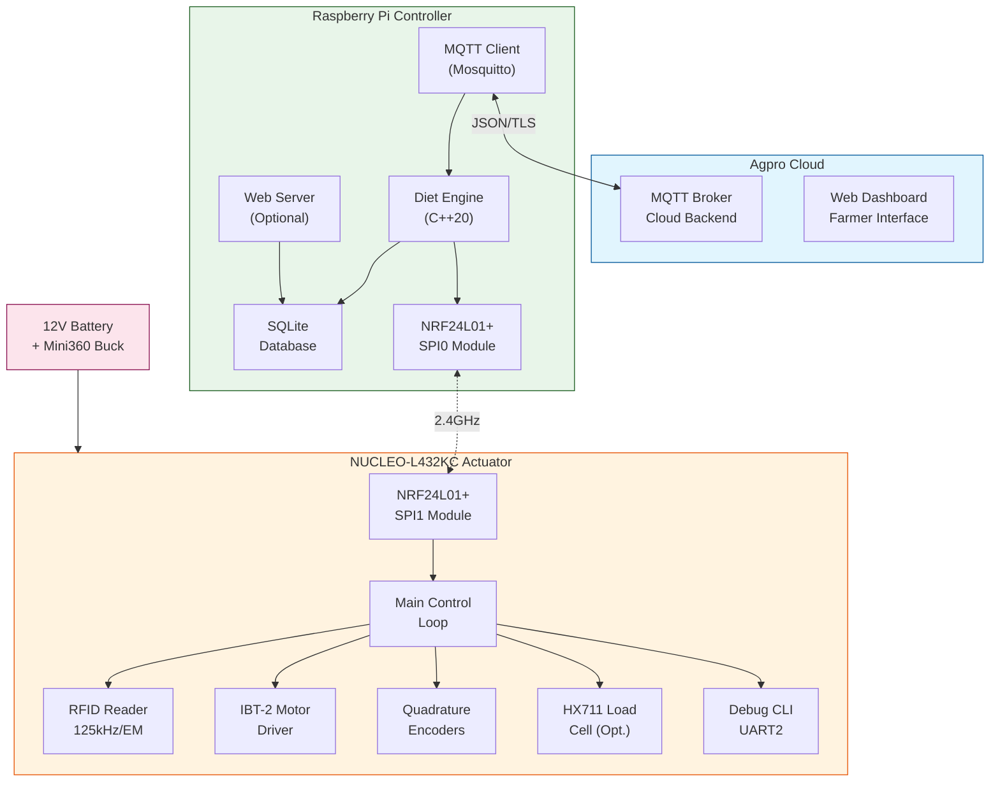
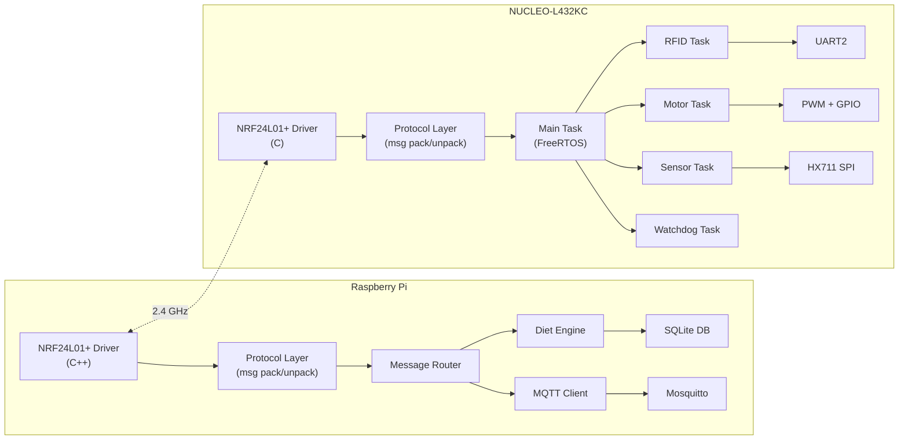
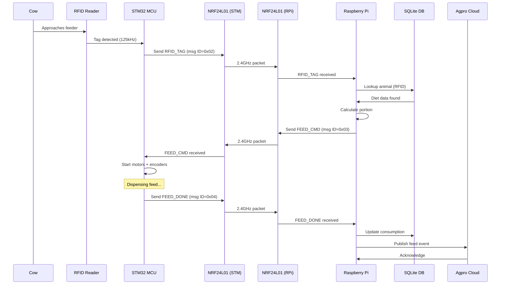
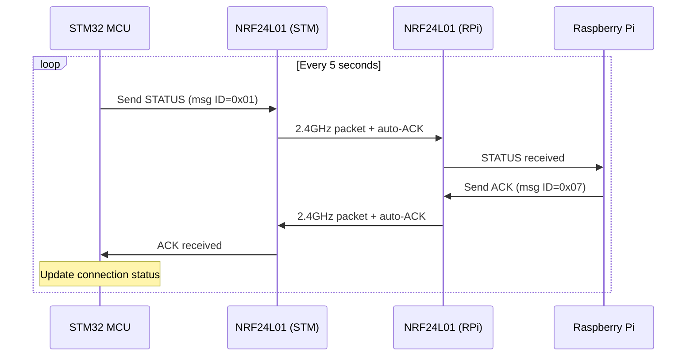
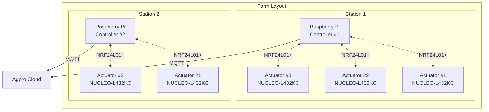
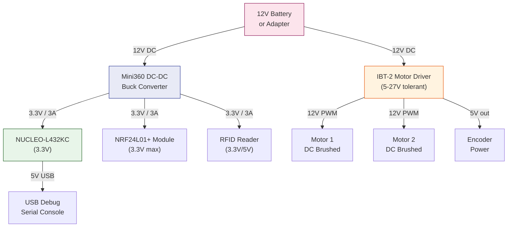
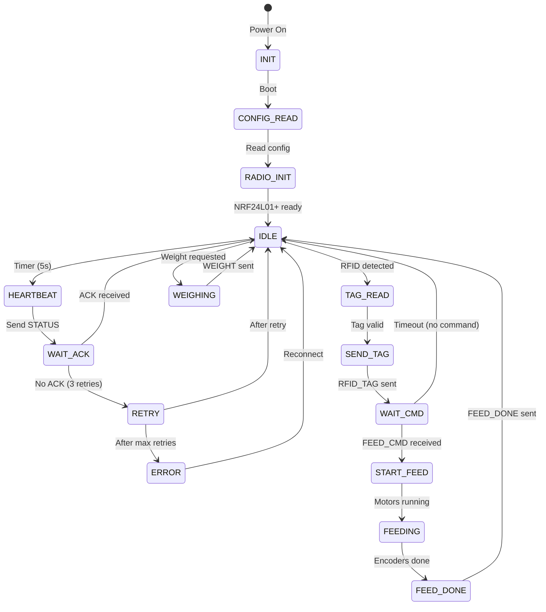
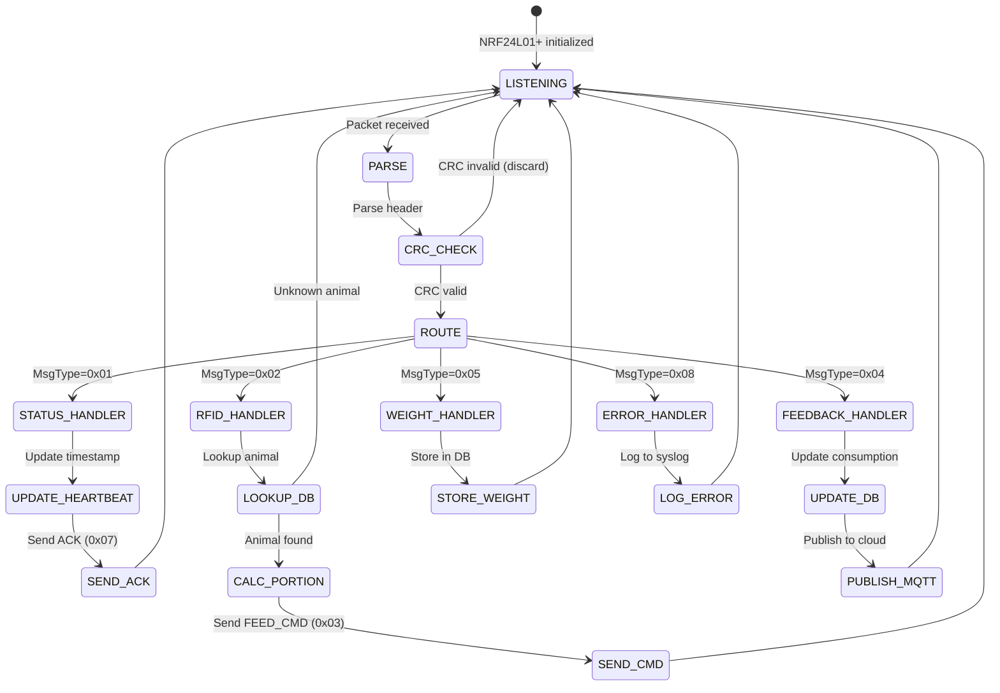
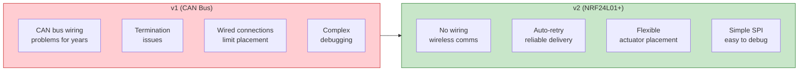

# WiFeeder v2 — Architecture Overview

> **Version**: 2.0.0  
> **Communication**: NRF24L01+ 2.4 GHz Wireless  
> **MCU**: STM32 NUCLEO-L432KC  
> **Host**: Raspberry Pi 3B+/4  

---

## Table of Contents

1. [System Overview](#system-overview)
2. [Component Architecture](#component-architecture)
3. [Data Flow](#data-flow)
4. [Network Topology](#network-topology)
5. [Power Architecture](#power-architecture)
6. [State Machines](#state-machines)
7. [Directory Structure](#directory-structure)

---

## System Overview



---

## Component Architecture



---

## Data Flow

### End-to-End Feeding Cycle



### Heartbeat & Status Flow



---

## Network Topology



---

## Power Architecture



---

## STM32 State Machine



---

## Message Routing (Raspberry Pi)



---

## Directory Structure

```
wifeeder-v2/
├── README.md                          # Project overview
├── ARCHITECTURE.md                    # This file
├── HARDWARE.md                        # Hardware specs & wiring
├── PROTOCOL.md                        # NRF24L01+ protocol
├── SOFTWARE.md                        # Software architecture
├── TESTING.md                         # Test plan
├── DEPLOYMENT.md                      # Deployment guide
├── TROUBLESHOOTING.md                 # Common issues
├── BILL_OF_MATERIALS.md              # Materials list
│
├── stm32/                             # STM32 firmware
│   ├── Core/
│   │   ├── Inc/                       # Headers
│   │   └── Src/                       # Source
│   ├── Drivers/                       # HAL & CMSIS
│   ├── Middlewares/                   # FreeRTOS
│   └── Config/                        # FreeRTOS config
│
├── raspberry/                         # Raspberry Pi controller
│   ├── src/                           # C++ source
│   ├── include/                       # C++ headers
│   ├── config/                        # JSON configs
│   └── tests/                         # GTest tests
│
├── docs/                              # Additional docs
├── scripts/                           # Build & deploy scripts
├── tests/                             # Integration tests
│   ├── unit/                          # Unit tests
│   ├── integration/                   # Integration tests
│   └── system/                        # System tests
└── assets/                            # Images & diagrams
```

---

## Key Design Decisions

| Decision | Rationale |
|----------|-----------|
| NRF24L01+ over CAN | Eliminates wiring issues; cheaper modules |
| NUCLEO-L432KC over L486 | Smaller, cheaper, sufficient peripherals |
| IBT-2 over GTK08 | BTS7960B more robust; better current handling |
| Mini360 buck converter | Efficient 12V→3.3V; adjustable; 3A capacity |
| FreeRTOS (kept) | Real-time motor/encoder control needs |
| SQLite (new on RPi) | Better structured queries vs JSON file |
| 1 Mbps NRF data rate | Best balance of range/speed |

---

## Comparison: v1 vs v2


