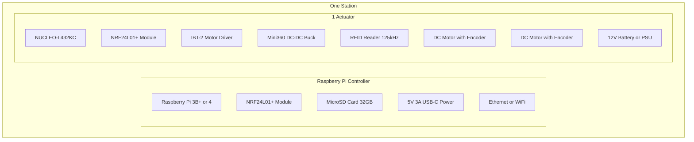
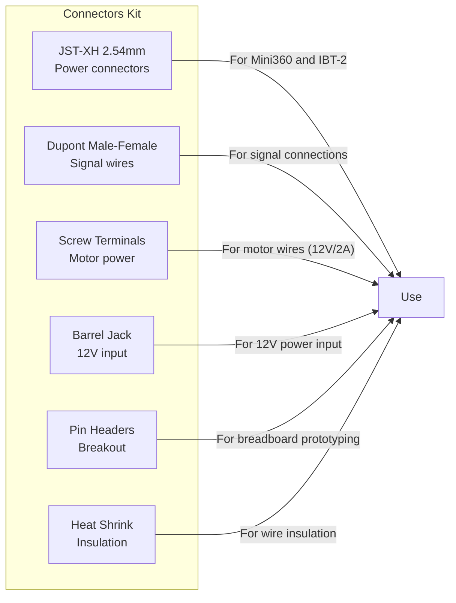
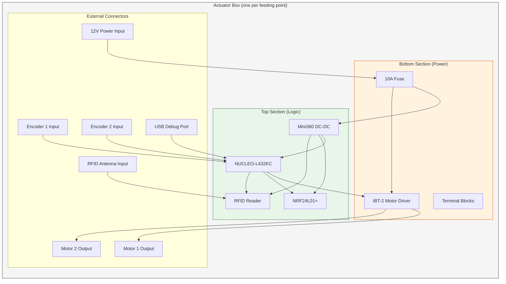

# WiFeeder v2 — Bill of Materials

---

## 1. Per Station (1 Controller + 1 Actuator)

---

## 2. Detailed Materials List

### 2.1 Raspberry Pi Controller (1 per station)

| # | Item | Model/Spec | Qty | Est. Cost (USD) | Source |
|---|------|-----------|-----|-----------------|--------|
| 1 | Raspberry Pi | 3B+ or 4 (2GB+) | 1 | $35-55 | amazon.com, pishop.us |
| 2 | NRF24L01+ Module | nRF24L01+P with antenna | 1 | $2-5 | amazon.com, aliexpress.com |
| 3 | MicroSD Card | 32GB Class 10 A1 | 1 | $8-12 | amazon.com |
| 4 | Power Supply | 5V 3A USB-C | 1 | $10-15 | amazon.com |
| 5 | Jumper Wires | Dupont M-F, 20cm | 1 set | $3-5 | amazon.com |
| 6 | Breadboard | 400-point (optional) | 1 | $3-5 | amazon.com |

**Subtotal Pi**: ~$61-97

### 2.2 STM32 Actuator (per feeding point)

| # | Item | Model/Spec | Qty | Est. Cost (USD) | Source |
|---|------|-----------|-----|-----------------|--------|
| 1 | NUCLEO Board | NUCLEO-L432KC | 1 | $11-15 | st.com, mouser.com, digikey.com |
| 2 | NRF24L01+ Module | nRF24L01+P with antenna | 1 | $2-5 | amazon.com, aliexpress.com |
| 3 | Motor Driver | IBT-2 (BTS7960B) | 1 | $8-15 | amazon.com, aliexpress.com |
| 4 | Actuator PCB | Hybrid carrier ([`pcb/`](pcb/)) | 1 | fab quote | JLCPCB / PCBWay |
| 4a | 5 V / 3.3 V bucks | AP63205 + AP63203 (on PCB) | 1+1 | $2-4 | LCSC / Digi-Key |
| 4b | PCA9685 | TSSOP-28 (on PCB, not breakout) | 1 | $2-4 | LCSC / Adafruit die |
| 4c | Mini360 | DNP fallback only | 0 | — | stuff only if U2 omitted |
| 5 | RFID Reader | 125kHz EM4100 compatible | 1 | $15-30 | amazon.com, aliexpress.com |
| 6 | DC Motor | 12V with encoder (400 PPR) | 2 | $20-40 each | amazon.com, pololu.com |
| 7 | Power Supply | 12V 10A DC or Battery | 1 | $20-50 | amazon.com |
| 8 | Jumper Wires | Dupont M-M, 20cm | 1 set | $3-5 | amazon.com |
| 9 | Breadboard | Bench only (no-PCB bring-up) | 0–1 | $5-10 | amazon.com |
| 10 | Screw Terminals | 2-pin / 4-pin blocks | 5 | $5-8 | amazon.com |

**Subtotal Actuator**: ~$111-223

### 2.3 Optional Components

| # | Item | Model/Spec | Qty | Est. Cost (USD) | Notes |
|---|------|-----------|-----|-----------------|-------|
| 1 | HX711 Module | Load Cell ADC | 1 | $3-5 | For weighing |
| 2 | Load Cell | 50kg or 100kg | 1 | $10-20 | For weighing |
| 3 | NRF24L01+ PA+LNA | High-power version | 1 | $5-10 | For longer range |
| 4 | USB-Serial Adapter | CP2102 or FT232 | 1 | $5-10 | For debug CLI |
| 5 | Multimeter | Digital | 1 | $15-30 | Essential for debugging |
| 6 | Logic Analyzer | 8ch 24MHz | 1 | $10-20 | For signal analysis |
| 7 | Oscilloscope | DSO138 or similar | 1 | $20-40 | For PWM/encoder analysis |

**Subtotal Optional**: ~$68-135

---

## 3. Total Cost Summary

| Configuration | Cost Range |
|---------------|-----------|
| **Minimal** (1 Pi + 1 Actuator, no weighing) | **$172-320** |
| **Standard** (1 Pi + 1 Actuator + weighing) | **$185-345** |
| **Full** (1 Pi + 1 Actuator + weighing + tools) | **$253-480** |
| **+ Each additional actuator** | +$111-223 |

Compare to v1 (CAN bus):
| v1 Cost | v2 Cost | Savings |
|---------|---------|---------|
| ~$200-350 per actuator | ~$111-223 per actuator | **~30% cheaper** |

---

## 4. Recommended Suppliers

| Supplier | URL | Best For |
|----------|-----|----------|
| **STMicroelectronics** | [st.com](https://www.st.com) | NUCLEO boards (official) |
| **Mouser** | [mouser.com](https://www.mouser.com) | Electronic components |
| **DigiKey** | [digikey.com](https://www.digikey.com) | Electronic components |
| **Amazon** | [amazon.com](https://www.amazon.com) | Kits, tools, fast shipping |
| **AliExpress** | [aliexpress.com](https://www.aliexpress.com) | Cheap modules (slower) |
| **Pololu** | [pololu.com](https://www.pololu.com) | Motors with encoders |
| **Adafruit** | [adafruit.com](https://www.adafruit.com) | Modules, tutorials |
| **SparkFun** | [sparkfun.com](https://www.sparkfun.com) | Modules, breakout boards |

---

## 5. Connector Kit (for NUCLEO-L432KC)

---

## 6. Tool Checklist

- [ ] Soldering iron (if making permanent connections)
- [ ] Wire stripper/cutter
- [ ] Multimeter (voltage, continuity, resistance)
- [ ] USB Micro-B cable (for NUCLEO programming)
- [ ] MicroSD card reader (for RPi OS installation)
- [ ] Screwdriver set (small flathead and Phillips)
- [ ] Heat shrink tubing + heat gun (or lighter)
- [ ] Electrical tape
- [ ] Tweezers (for small component handling)
- [ ] Magnifying glass or loupe (for small text on PCBs)

---

## 7. Pre-Assembled Kits (Alternative)

For faster deployment, consider pre-assembled kits:

| Kit | Contents | Est. Cost |
|-----|----------|-----------|
| **WiFeeder v2 Starter** | NUCLEO + NRF + IBT-2 + Mini360 + Jumper wires | $50-70 |
| **WiFeeder v2 Complete** | Starter + RFID + 2x Motors + Encoders + PSU | $150-200 |
| **WiFeeder v2 Full** | Complete + HX711 + Load Cell + Tools set | $200-280 |

*(Contact Codintek for custom pre-assembled kits)*

---

## 8. Wiring Harness Diagram

---

## 9. Ordering Checklist

### Phase 1: Development & Testing (1 station)

- [ ] 1x Raspberry Pi 4 (2GB)
- [ ] 2x NRF24L01+ modules
- [ ] 1x NUCLEO-L432KC
- [ ] 1x IBT-2 motor driver
- [ ] 1x Mini360 DC-DC converter
- [ ] 1x RFID reader (125kHz)
- [ ] 2x DC motors with encoders
- [ ] 1x 12V 10A power supply
- [ ] Jumper wires, breadboard, tools

### Phase 2: Production Rollout (per additional station)

- [ ] 1x NUCLEO-L432KC
- [ ] 1x NRF24L01+ module
- [ ] 1x IBT-2 motor driver
- [ ] 1x Mini360 DC-DC converter
- [ ] 1x RFID reader
- [ ] 2x DC motors with encoders
- [ ] 1x 12V 10A power supply
- [ ] Wiring harness (pre-made)

---

## 10. Sustainability Notes

| Component | Lifespan | Recyclable |
|-----------|----------|------------|
| NUCLEO-L432KC | 5+ years | Yes (electronics recycling) |
| NRF24L01+ | 3-5 years | Yes (small PCB) |
| IBT-2 | 5+ years | Yes (electronics recycling) |
| Mini360 | 3-5 years | Yes |
| Motors | 2-5 years (brushes wear) | Yes (metal) |
| RFID Reader | 5+ years | Yes |
| 12V Battery | 2-3 years (lead-acid) | Yes (lead-acid recycling) |
| 12V PSU | 5+ years | Yes |
