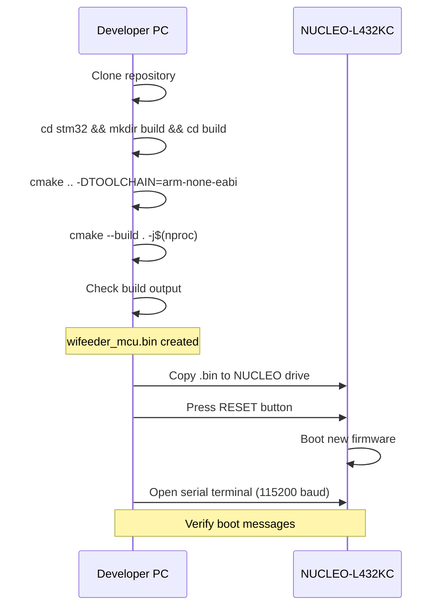
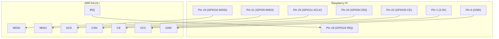

# WiFeeder v2 — Deployment Guide

---

## Table of Contents

1. [STM32 Firmware Deployment](#stm32-firmware-deployment)
2. [Raspberry Pi Deployment](#raspberry-pi-deployment)
3. [NRF24L01+ Setup](#nrf24l01-setup)
4. [Systemd Service Configuration](#systemd-service-configuration)
5. [MQTT Configuration](#mqtt-configuration)
6. [Docker Deployment (Optional)](#docker-deployment-optional)

---

## 1. STM32 Firmware Deployment

### 1.1 Prerequisites

```bash
# Install ARM GCC toolchain
sudo apt update
sudo apt install gcc-arm-none-eabi binutils-arm-none-eabi
```

### 1.2 Build & Flash



### 1.3 CLI Configuration

After flashing, configure the actuator via serial terminal:

```text
# Connect to NUCLEO serial at 115200 baud
screen /dev/ttyACM0 115200

# Set device ID (1-254)
flash-device-id 1

# Set machine type
flash-device-type 3

# Verify
get-id
get-type

# Set NRF channel (optional, default 76)
set-nrf-channel 76

# Reset to apply
reset
```

---

## 2. Raspberry Pi Deployment

### 2.1 OS Setup

```bash
# On Raspberry Pi (fresh Raspbian/Ubuntu)
sudo apt update && sudo apt upgrade -y

# Enable SPI interface
sudo raspi-config
# → Interface Options → SPI → Enable

# Install dependencies
sudo apt install -y \
    cmake \
    build-essential \
    g++ \
    libmosquitto-dev \
    libsqlite3-dev \
    libwiringpi-dev \
    git

# Enable SPI
sudo sed -i 's/#dtparam=spi=on/dtparam=spi=on/' /boot/config.txt
sudo reboot
```

### 2.2 Build Application

```bash
# Clone repository
git clone <repo-url> /opt/wifeeder-v2

# Build
cd /opt/wifeeder-v2/raspberry
mkdir build && cd build
cmake .. -DCMAKE_BUILD_TYPE=Release
cmake --build . -j$(nproc)

# Install
sudo cmake --install .
sudo cp config/config.json /etc/wifeeder-v2/config.json
```

### 2.3 Database Setup

```bash
# Create database directory
sudo mkdir -p /etc/wifeeder-v2

# Initialize SQLite database
sudo sqlite3 /etc/wifeeder-v2/wifeeder.db < /opt/wifeeder-v2/raspberry/config/schema.sql

# Set permissions
sudo chown -R pi:pi /etc/wifeeder-v2
```

---

## 3. NRF24L01+ Setup

### 3.1 Wiring Verification



### 3.2 NRF Test

```bash
# Build and run NRF test tool
cd /opt/wifeeder-v2/raspberry
g++ -o nrf_test tools/nrf_test.cpp src/nrf24l01.cpp \
    -lwiringPi -Iinclude
sudo ./nrf_test

# Expected output:
# NRF24L01+ detected: OK
# SPI communication: OK
# TX test: PASS
# RX test: PASS
```

---

## 4. Systemd Service Configuration

### 4.1 Service File

```bash
sudo tee /etc/systemd/system/wifeeder-v2.service << 'EOF'
[Unit]
Description=WiFeeder v2 Controller Service
Documentation=https://github.com/codintek/wifeeder-v2
After=network.target mosquitto.service
Wants=mosquitto.service

[Service]
Type=simple
User=pi
Group=pi
WorkingDirectory=/opt/wifeeder-v2
ExecStartPre=/bin/sleep 5
ExecStart=/opt/wifeeder-v2/raspberry/build/wifeeder_host
Restart=always
RestartSec=10
StartLimitInterval=60
StartLimitBurst=5

# Logging
StandardOutput=journal
StandardError=journal
SyslogIdentifier=wifeeder-v2

# Security hardening
NoNewPrivileges=yes
PrivateTmp=yes
ProtectSystem=full
ProtectHome=yes
ReadWritePaths=/etc/wifeeder-v2

[Install]
WantedBy=multi-user.target
EOF
```

### 4.2 Enable & Start

```bash
sudo systemctl daemon-reload
sudo systemctl enable wifeeder-v2
sudo systemctl start wifeeder-v2

# Check status
sudo systemctl status wifeeder-v2

# View logs
sudo journalctl -u wifeeder-v2 -f

# View last 100 lines
sudo journalctl -u wifeeder-v2 -n 100 --no-pager
```

---

## 5. MQTT Configuration

### 5.1 Mosquitto Setup

```bash
# Install
sudo apt install mosquitto mosquitto-clients -y

# Configure
sudo tee /etc/mosquitto/conf.d/wifeeder.conf << 'EOF'
listener 1883
allow_anonymous false
password_file /etc/mosquitto/passwd

# Logging
log_dest file /var/log/mosquitto/mosquitto.log
log_type all
EOF

# Set password
sudo mosquitto_passwd -c /etc/mosquitto/passwd client2
# Enter: wifeeder@agTEK.2020_2_mqtt

sudo systemctl restart mosquitto
```

### 5.2 Test MQTT

```bash
# Subscribe to all topics
mosquitto_sub -h localhost -u client2 -P 'wifeeder@agTEK.2020_2_mqtt' \
    -t 'WCN-A100-0001X/#' -v

# In another terminal, publish test message
mosquitto_pub -h localhost -u client2 -P 'wifeeder@agTEK.2020_2_mqtt' \
    -t 'WCN-A100-0001X/diet/dlink/data' \
    -m '{"rfid":19946219,"diet_id":12345}'
```

---

## 6. Docker Deployment (Optional)

### 6.1 Dockerfile

```dockerfile
FROM ubuntu:22.04

RUN apt update && apt install -y \
    cmake build-essential g++ \
    libmosquitto-dev libsqlite3-dev libwiringpi-dev \
    && rm -rf /var/lib/apt/lists/*

WORKDIR /opt/wifeeder-v2
COPY raspberry/ .

RUN mkdir build && cd build && \
    cmake .. -DCMAKE_BUILD_TYPE=Release && \
    cmake --build . -j$(nproc)

ENTRYPOINT ["./build/wifeeder_host"]
```

### 6.2 Use Docker Compose

```yaml
# docker-compose.yml
version: '3'
services:
  wifeeder:
    build: .
    privileged: true
    devices:
      - /dev/spidev0.0:/dev/spidev0.0
      - /dev/spidev0.1:/dev/spidev0.1
      - /dev/gpiomem:/dev/gpiomem
    volumes:
      - /etc/wifeeder-v2:/etc/wifeeder-v2
      - /var/log:/var/log
    restart: always
```

```bash
docker-compose up -d
docker-compose logs -f
```

---

## 7. Deployment Checklist

### Pre-Deployment

- [ ] NRF24L01+ wired correctly on both sides
- [ ] NRF test passes (both STM32 and RPi)
- [ ] RFID reader responds to tags
- [ ] Motors spin correctly (both directions)
- [ ] Encoders count accurately
- [ ] HX711 calibrated (if used)
- [ ] Database initialized with schema
- [ ] MQTT broker running and accessible
- [ ] Config files set with correct values

### Deployment

- [ ] Flash STM32 firmware
- [ ] Configure STM32 via CLI (device ID, type, channel)
- [ ] Install RPi software
- [ ] Start systemd service
- [ ] Verify STATUS messages in logs
- [ ] Test full feed cycle
- [ ] Verify MQTT events in cloud
- [ ] Check database updates
- [ ] Monitor for 1 hour

### Post-Deployment

- [ ] Check log for errors
- [ ] Verify battery voltage
- [ ] Test disconnection recovery
- [ ] Test power cycle recovery
- [ ] Document any issues

---

## 8. Health Monitoring

```bash
#!/bin/bash
# scripts/health_check.sh

echo "=== WiFeeder v2 Health Check ==="
echo

# Check service
if systemctl is-active --quiet wifeeder-v2; then
    echo "✅ Service: running"
else
    echo "❌ Service: stopped"
fi

# Check database
if [ -f /etc/wifeeder-v2/wifeeder.db ]; then
    echo "✅ Database: exists"
else
    echo "❌ Database: missing"
fi

# Check SPI
if [ -e /dev/spidev0.0 ]; then
    echo "✅ SPI: enabled"
else
    echo "❌ SPI: disabled"
fi

# Check MQTT
if mosquitto_sub -h localhost -t '$SYS/#' -C 1 -W 2 > /dev/null 2>&1; then
    echo "✅ MQTT: connected"
else
    echo "❌ MQTT: not responding"
fi

# Recent feeds
echo
echo "--- Recent Feeds ---"
sqlite3 /etc/wifeeder-v2/wifeeder.db \
    "SELECT datetime(timestamp, 'unixepoch'), rfid, motor1_actual
     FROM feed_history ORDER BY timestamp DESC LIMIT 5;"
```

---

## 9. Rollback Procedure

If v2 deployment fails:

```bash
# Stop v2 service
sudo systemctl stop wifeeder-v2
sudo systemctl disable wifeeder-v2

# Restore v1 (if still installed)
sudo systemctl enable controller
sudo systemctl start controller

# Or reboot to previous state
sudo reboot
```
