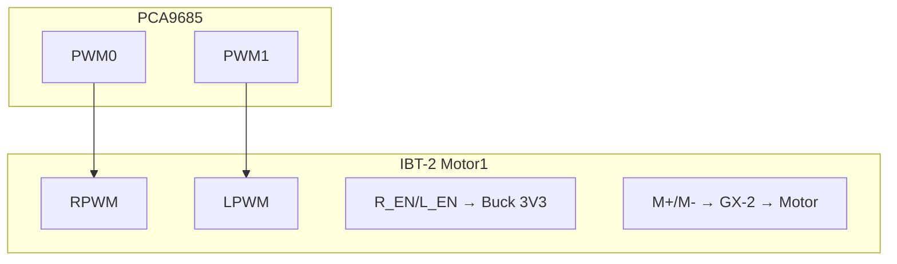
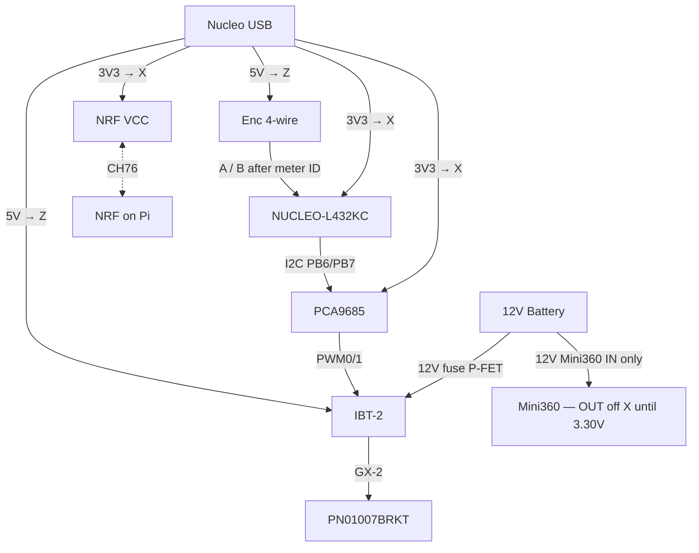

# WiFeeder v2 — Hardware Specifications & Wiring

> **MCU**: NUCLEO-L432KC (STM32L432KCU6, UFQFPN32)  
> **Motor Driver**: IBT-2 (BTS7960B) via **PCA9685** PWM  
> **Power**: Mini360 DC-DC Buck Converter  
> **Wireless**: NRF24L01+ 2.4 GHz (bit-bang SPI)  
> **Authority**: [`wiring/CONNECTOR_MAP.md`](wiring/CONNECTOR_MAP.md) + [`stm32/Core/Inc/board.h`](stm32/Core/Inc/board.h)

**Package limits:** No PB8–PB11, PC0–PC13, TIM3, or TIM4. LED = **PB3**. **PA6 shorted** — NRF MISO = **PB1**. **One jumper per Nucleo pin**. Bench logic power is **Nucleo USB** (3V3→X, 5V→Z). **Do not** feed Mini360 OUT into Nucleo 3V3 until the pot is **3.30 V**. **NRF VCC = 3.3 V** (never Nucleo 5V).

---

## 1. NUCLEO-L432KC Pin Allocation (MVP)

Diagram: [`diagrams/HARDWARE-01.mmd`](diagrams/HARDWARE-01.mmd).

| Pin | Mode | Function | Connected To |
|-----|------|----------|--------------|
| PA0 | AF1 TIM2_CH1 | Encoder 1A | Enc **green** → BB col 40 |
| PA1 | AF1 TIM2_CH2 | Encoder 1B | Enc **white** → BB col 41 |
| PA2 | AF8 LPUART1 | Debug VCP | ST-Link |
| PA3 | USART2_RX | RFID (deferred) | — |
| PA4 | GPIO Out | NRF CSN | NRF CSN |
| PA5 | GPIO Out | NRF SCK | NRF SCK |
| PA6 | — | **Do not use** | Shorted |
| PA7 | GPIO Out | NRF MOSI | NRF MOSI |
| PA8 / PA9 | — | Free (legacy TIM1) | — |
| PB0 | GPIO Out | NRF CE | NRF CE |
| PB1 | GPIO In PU | NRF MISO | NRF MISO |
| PB3 | GPIO Out | LED | LD3 |
| PB4 / PB5 | — | HX711 (deferred) | — |
| **PB6** | I2C SCL | **PCA9685 SCL** | PCA SCL (D5) |
| **PB7** | I2C SDA | **PCA9685 SDA** | PCA SDA (D4) |

**MVP:** PCA9685 + 1 motor + Enc1 (600 P/R) + NRF + LED. RFID / HX711 / Motor2 deferred.

### board.h ↔ wiring checklist

| `board.h` | Wiring |
|-----------|--------|
| `BOARD_NRF_*` | PA5/7, PB1, PA4, PB0 |
| `BOARD_I2C_SCL/SDA` | PB6 / PB7 |
| `BOARD_PCA_CH_RPWM/LPWM` | PWM0 / PWM1 |
| `BOARD_ENCODER_PPR` | **600** |
| `BOARD_ENCODER_COUNTS_PER_REV` | **2400** (TIM2 ×4) |

---

## 2. NRF24L01+ Wiring

STM: PA5 SCK, PB1 MISO, PA7 MOSI, PA4 CSN, PB0 CE. **VCC = 3.3 V** (Buck / BB X). Channel **76**.

Pi: SPI0 + GPIO25 CE; **VCC = pin 1 (3.3 V)**.

**Never** put Nucleo/Pi **5 V** on module VCC. That is ~4.8 V; abs max is 3.6 V. It destroys PA/LNA while SPI still looks healthy.

---

## 3. Motor path (PCA9685 → IBT-2)

- OE → Buck GND (outputs enabled)
- Forward: RPWM=PWM, LPWM=0 · Reverse: RPWM=0, LPWM=PWM
- PCA PWM ~1 kHz (IBT-tolerant)
- Legacy TIM1/TIM16 on PA8/PB6 **retired** for MVP

Fritzing: [`wiring/blocks/03-motor.fzz`](wiring/blocks/03-motor.fzz)

---

## 4. Encoder Wiring

**GTS06-OC-RA600A-2M** (600 P/R, NPN OC) as a **factory 4-wire assembly** (encoder + cable + plug). Do not wire a separate GX-4 and encoder body.

Pigtail is **2× red + 2× black** — color is **not** VCC/GND/A/B. Use molded pin numbers + the meter procedure in [`wiring/CONNECTOR_MAP.md`](wiring/CONNECTOR_MAP.md). Then: VCC → BB **Z**, GND → **Y**, A → col **40** / PA0, B → col **41** / PA1.

Pull-ups **4.7 kΩ on A/B → 3V3** (not 5 V; not stacked on Nucleo A0/A1). TIM2 ×4 → **2400 counts/rev**. Swap A/B if direction is inverted.

---

## 5. RFID / HX711

Deferred in MVP Fritzing. Drivers exist; gated with `WIFEEDER_MVP` in firmware. Pins reserved: PA3 RFID, PB4/PB5 HX711.

---

## 6. Complete Wiring

**Production path:** hybrid carrier PCB — [`pcb/README.md`](pcb/README.md), pinouts [`pcb/CONNECTORS.md`](pcb/CONNECTORS.md).  
On-board: PCA9685, fixed 5 V / 3.3 V bucks, fuse, TVS, P-FET, pull-ups. Modules: Nucleo-32, IBT-2, NRF+AM1117.  
**Bench / no-PCB:** [`wiring/wifeeder-v2.fzz`](wiring/wifeeder-v2.fzz) · blocks in [`wiring/blocks/`](wiring/blocks/).

---

## 7. Power Budget

| Component | Voltage | Notes |
|-----------|---------|-------|
| Nucleo | 3.3V | Carrier AP63203 (USB unplugged) |
| PCA9685 | 3.3V | On-carrier |
| NRF | **3.3V** | Buck / BB X — never Nucleo 5V |
| IBT logic | 5V | Carrier 5 V rail |
| Motor | 12V | Battery via fuse / P-FET → IBT B+ |

---

## 8. NUCLEO-L432KC Key Specs

| Parameter | Value |
|-----------|-------|
| Core | Cortex-M4 |
| Flash / SRAM | 256 KB / 64 KB |
| Timers (MVP) | TIM2 Enc1; SysTick |
| PWM | External PCA9685 |
| Debug | SWD + ST-Link |
