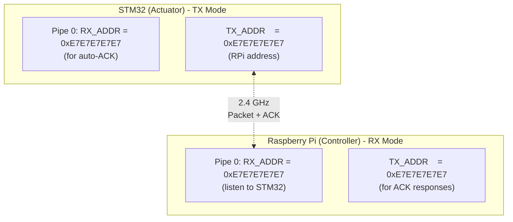
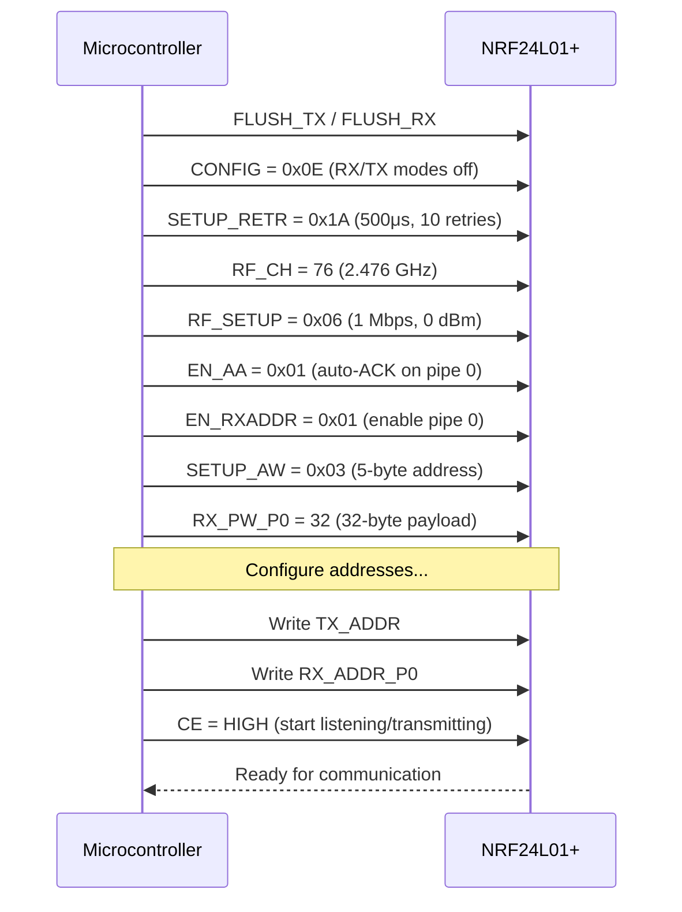
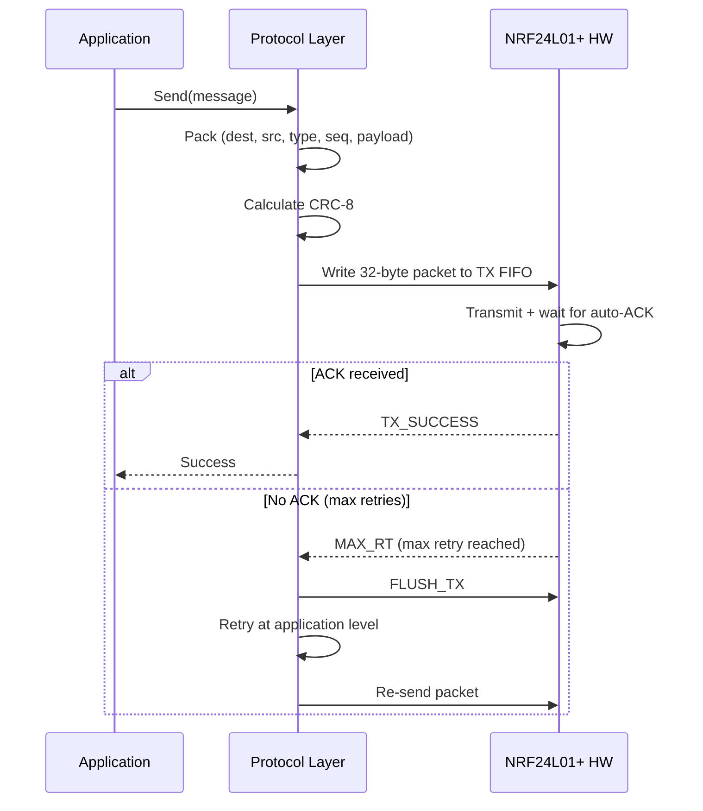
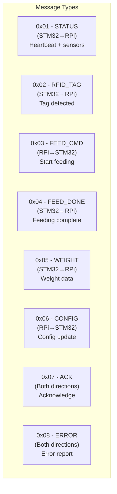
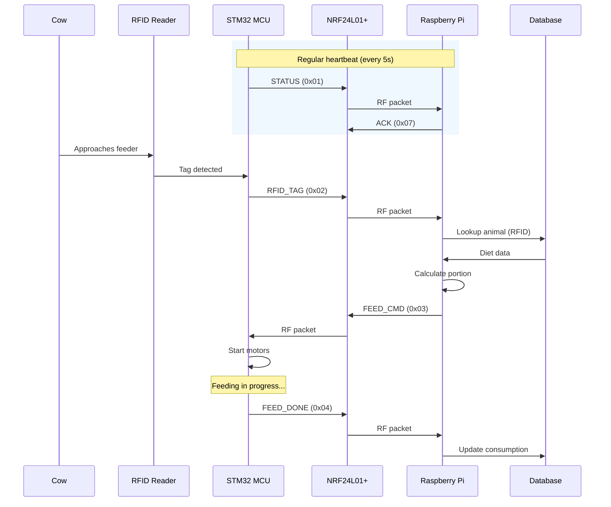
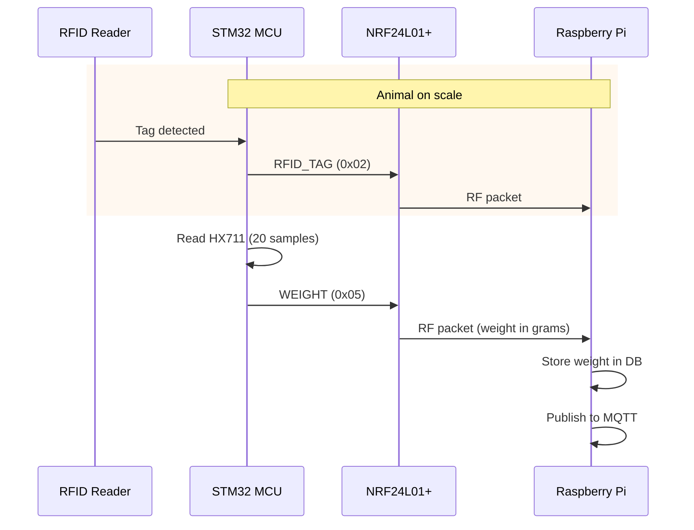
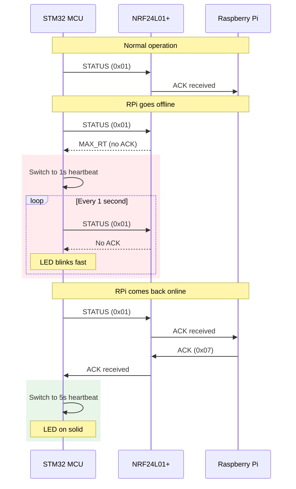
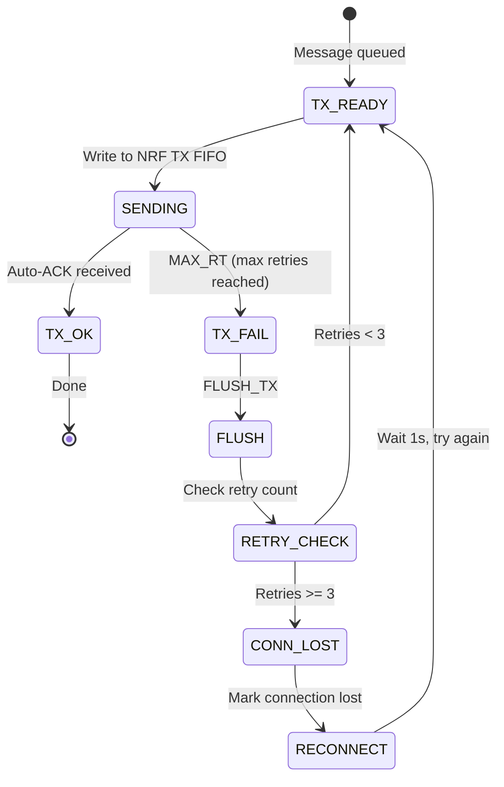
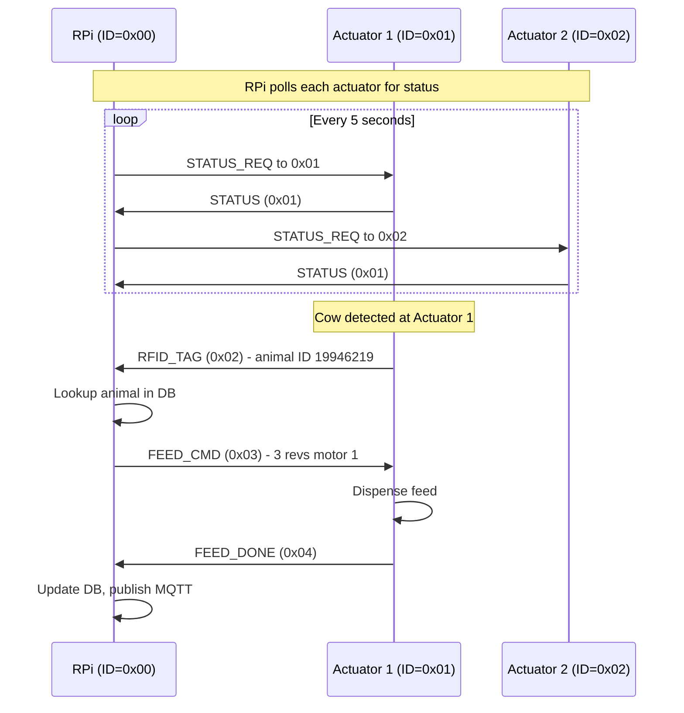

# WiFeeder v2 — NRF24L01+ Communication Protocol

> **Version**: 2.0.0  
> **Transport**: NRF24L01+ Enhanced ShockBurst  
> **Data Rate**: 1 Mbps  
> **Payload**: 32 bytes max per packet  

---

## Table of Contents

1. [NRF24L01+ Configuration](#nrf24l01-configuration)
2. [Packet Format](#packet-format)
3. [Message Types](#message-types)
4. [Communication Flows](#communication-flows)
5. [Error Handling & Retry](#error-handling--retry)
6. [Security & Addressing](#security--addressing)

---

## 1. NRF24L01+ Configuration

### 1.1 Radio Parameters

| Parameter | Value | Reason |
|-----------|-------|--------|
| **Channel** | 76 (2.476 GHz) | Production default (`PROTOCOL` / firmware / tests 09–10). Lab-only SI24R1 note: try 64 via `sweep` |
| **Data Rate** | 1 Mbps | Best balance range/speed |
| **TX Power** | 0 dBm | Default; upgrade to +7 dBm if needed |
| **CRC** | 16-bit (NRF hardware) | Built-in packet integrity |
| **Auto-Ack** | Enabled (pipe 0) | Free reliability layer |
| **Retries** | 10 retries, 500 μs delay | Protocol layer also handles retries |
| **Address Width** | 5 bytes | Standard NRF24L01+ |
| **Payload Size** | 32 bytes (dynamic) | ADR enabled |

### 1.2 Pipe Configuration



### 1.3 Initialization Sequence



---

## 2. Packet Format

### 2.1 Application-Level Packet

```
Byte Offset  0        1        2        3       4-31
            ┌────────┬────────┬────────┬────────┬──────────────┐
            │ Dest   │ Src    │ Msg    │ Seq    │ Payload +    │
            │ ID     │ ID     │ Type   │ Num    │ CRC-8        │
            │ 1 B    │ 1 B    │ 1 B    │ 1 B    │ 0-28 B       │
            └────────┴────────┴────────┴────────┴──────────────┘
                                              Last byte = CRC-8
```

| Field | Size | Description |
|-------|------|-------------|
| **Dest ID** | 1 byte | Destination device ID (0x00 = Controller, 0x01-0xFE = Actuator) |
| **Src ID** | 1 byte | Source device ID |
| **Msg Type** | 1 byte | Message type (see below) |
| **Seq Num** | 1 byte | Rolling sequence number for duplicate detection |
| **Payload** | 0-27 bytes | Message-specific data |
| **CRC-8** | 1 byte | CRC-8 over bytes 0..(n-1), polynomial 0x07 |

Total: **4-32 bytes** fits in one NRF24L01+ packet.

### 2.2 Packet Lifecycle



---

## 3. Message Types

### 3.1 Message Type Overview



### 3.2 STATUS (0x01) — STM32 → RPi

**Sent**: Every 5 seconds (heartbeat), or 1 second if disconnected.

```
Byte Offset  4         5               6               7        8
            ┌─────────┬───────────────┬───────────────┬────────┬────────┐
            │ Heartbeat│ Sensor Status │ Battery Level │ Resvd │ CRC-8  │
            │ uint32   │ uint8         │ uint8         │ [3B]  │ 1 B    │
            └─────────┴───────────────┴───────────────┴────────┴────────┘

Sensor Status (byte 5):
  Bit 0: Motor 1 OK      (0=OK, 1=fault)
  Bit 1: Motor 2 OK      (0=OK, 1=fault)
  Bit 2: RFID OK         (0=OK, 1=fault)
  Bit 3: HX711 OK        (0=OK, 1=fault)
  Bit 4: Connection LED  (0=off, 1=on)
  Bit 5-7: Reserved

Battery Level (byte 6):
  0-100: Percentage (0xFF = unknown)
```

### 3.3 RFID_TAG (0x02) — STM32 → RPi

**Sent**: When RFID reader detects a valid tag.

```
Byte Offset  4          5-7             8
            ┌──────────┬───────────────┬────────┐
            │ Tag ID   │ Timestamp     │ CRC-8  │
            │ uint32   │ uint24 (ms)   │ 1 B    │
            └──────────┴───────────────┴────────┘

Tag ID: 26-bit EM4100 format (decimal)
Timestamp: Uptime in milliseconds when tag was read
```

### 3.4 FEED_CMD (0x03) — RPi → STM32

**Sent**: In response to RFID_TAG, after diet calculation.

```
Byte Offset  4-7         8-9               10-11             12
            ┌───────────┬─────────────────┬─────────────────┬────────┐
            │ Animal ID │ Motor 1 Revs    │ Motor 2 Revs    │ CRC-8  │
            │ uint32    │ uint16          │ uint16          │ 1 B    │
            └───────────┴─────────────────┴─────────────────┴────────┘

Animal ID:  26-bit RFID tag ID
Motor 1 Revs: Target revolutions for main motor
Motor 2 Revs: Target revolutions for complementary motor
```

### 3.5 FEED_DONE (0x04) — STM32 → RPi

**Sent**: After motors have completed their revolutions.

```
Byte Offset  4-7         8-9               10-11             12
            ┌───────────┬─────────────────┬─────────────────┬────────┐
            │ Animal ID │ Motor 1 Actual  │ Motor 2 Actual  │ CRC-8  │
            │ uint32    │ uint16          │ uint16          │ 1 B    │
            └───────────┴─────────────────┴─────────────────┴────────┘

Animal ID:    26-bit RFID tag ID
Motor 1 Actual: Actual revolutions dispensed (encoder count / 400)
Motor 2 Actual: Actual revolutions dispensed
```

### 3.6 WEIGHT (0x05) — STM32 → RPi

**Sent**: After weighing sequence completes.

```
Byte Offset  4-7         8-11            12
            ┌───────────┬───────────────┬────────┐
            │ Animal ID │ Weight (g)     │ CRC-8  │
            │ uint32    │ uint32        │ 1 B    │
            └───────────┴───────────────┴────────┘

Animal ID: 26-bit RFID tag ID (0 if standalone weighing)
Weight:    Weight in grams
```

### 3.7 CONFIG (0x06) — RPi → STM32

**Sent**: To update actuator configuration.

```
Byte Offset  4          5-8            9
            ┌──────────┬──────────────┬────────┐
            │ Param ID │ Value        │ CRC-8  │
            │ uint8    │ uint32       │ 1 B    │
            └──────────┴──────────────┴────────┘

Param IDs:
  0x01: Device Station ID
  0x02: Heartbeat interval (seconds)
  0x03: Motor speed (PWM 0-100%)
  0x04: RFID timeout (seconds)
```

### 3.8 ACK (0x07) — Both Directions

**Sent**: In response to any message to confirm receipt.

```
Byte Offset  4              5            6
            ┌──────────────┬────────────┬────────┐
            │ Echo Msg Type│ Status     │ CRC-8  │
            │ uint8        │ uint8      │ 1 B    │
            └──────────────┴────────────┴────────┘

Echo Msg Type: The MsgType being acknowledged
Status:
  0x00: OK
  0x01: Bad CRC
  0x02: Unknown message type
  0x03: Buffer full
```

### 3.9 ERROR (0x08) — Both Directions

**Sent**: When an unrecoverable error occurs.

```
Byte Offset  4              5-8            9
            ┌──────────────┬──────────────┬────────┐
            │ Error Code   │ Details       │ CRC-8  │
            │ uint8        │ uint32       │ 1 B    │
            └──────────────┴──────────────┴────────┘

Error Codes:
  0x01: Motor stall detected
  0x02: RFID read failure
  0x03: HX711 timeout
  0x04: Watchdog reset imminent
  0x05: Battery low
  0x06: Memory allocation failure
  0xFF: Unknown error (details in payload)
```

---

## 4. Communication Flows

### 4.1 Normal Feeding Sequence



### 4.2 Weighing Sequence



### 4.3 Disconnection Recovery



---

## 5. Error Handling & Retry



### Retry Parameters

| Parameter | Value |
|-----------|-------|
| NRF hardware retries | 10 (auto-ACK timeout × 10) |
| Retry delay (NRF) | 500 μs between retries |
| Application retries | 3 |
| Application retry delay | 100 ms between retries |
| Disconnect threshold | 3 consecutive failures |
| Reconnect interval | 1 second (during disconnection) |

---

## 6. Security & Addressing

### 6.1 Device Addressing Scheme

```mermaid
graph TB
    subgraph Farm["Farm Network"]
        Controller["RPi Controller<br/>ID = 0x00"]
        A1["Actuator 1<br/>ID = 0x01"]
        A2["Actuator 2<br/>ID = 0x02"]
        A3["Actuator 3<br/>ID = 0x03"]
        A4["...<br/>ID = 0x04-0xFE"]
    end

    Controller <--> |"Pipe 0<br/>0xE7E7E7E7E7"| A1
    Controller <--> |"Pipe 1<br/>0xC2C2C2C2C2"| A2
    Controller <--> |"Pipe 2<br/>0xC2C2C2C2C3"| A3
    Controller <--> |"Pipe 3-5"| A4

    note right of Controller
        NRF24L01+ supports 6 RX pipes.
        For >6 actuators, use time-sliced
        addressing or multiple NRF modules.
    end note
```

### 6.2 Multi-Actuator Protocol



---

## 7. CRC-8 Implementation

### 7.1 Parameters

| Parameter | Value |
|-----------|-------|
| Polynomial | 0x07 (x^8 + x^2 + x + 1) |
| Initial value | 0x00 |
| Final XOR | 0x00 |
| Reflected | No |

### 7.2 C Implementation

```c
uint8_t crc8(uint8_t *data, size_t len) {
    uint8_t crc = 0;
    for (size_t i = 0; i < len; i++) {
        crc ^= data[i];
        for (int j = 0; j < 8; j++) {
            if (crc & 0x80) crc = (crc << 1) ^ 0x07;
            else            crc = (crc << 1);
        }
    }
    return crc;
}
```

---

## 8. Performance

| Metric | Value |
|--------|-------|
| Packet air time (32 bytes, 1 Mbps) | ~320 μs |
| Turnaround (TX → ACK → ready) | ~250 μs |
| Effective throughput | ~500 kbps |
| Max actuators per RPi | 6 (1 per NRF pipe) |
| Max actuators (time-sliced) | 30+ |
| Range (indoor, 0 dBm) | ~30m |
| Range (outdoor, 0 dBm) | ~100m |
| Range (outdoor, +7 dBm) | ~500m |
