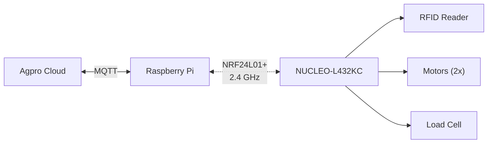
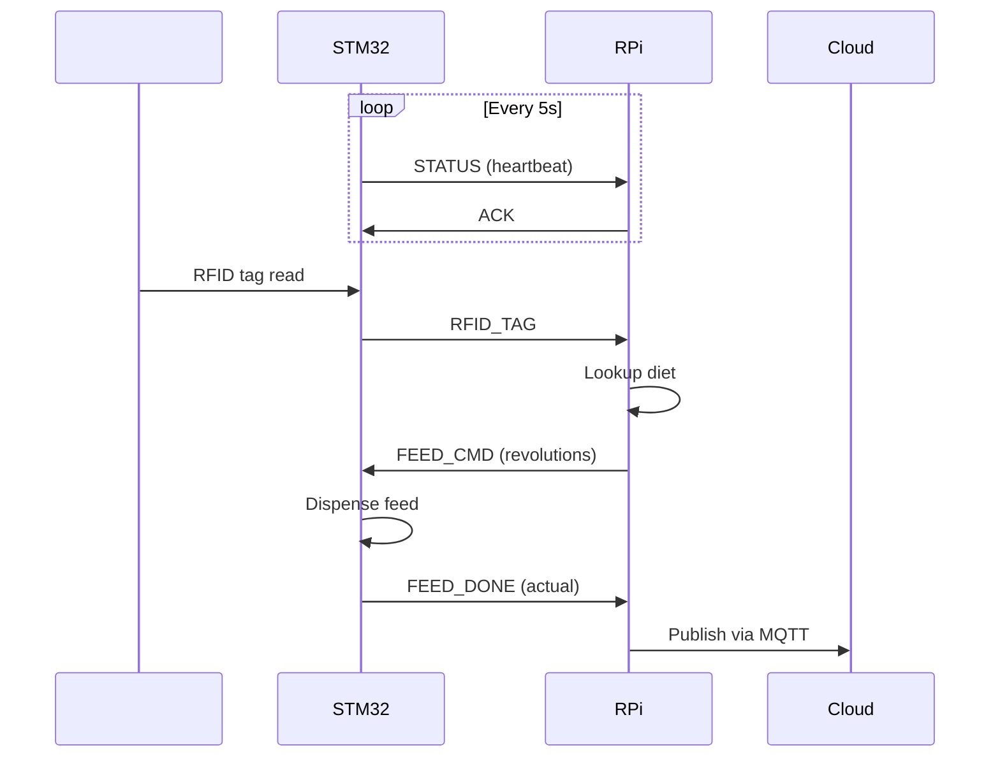

# WiFeeder v2 — Project README

> **Wireless Automatic Cow Feeding System**  
> NRF24L01+ 2.4 GHz Communication | NUCLEO-L432KC | Raspberry Pi  

> **Status (2026-08-11):** Wiring MVP locked (PCA9685). **NRF VCC = 3.3 V** — Nucleo 5V (~4.8 V) permanently kills PA/LNA (SPI can still look OK). Firmware motor path is I2C PCA9685. Actuator hybrid PCB in [`pcb/`](pcb/). Pi host uses **JSON**. RF over-air still the bring-up gate (need **new** modules after the 5 V damage).

---

## Quick Navigation

| Document | Description |
|----------|-------------|
| [docs/wifeeder-v2-final-plan.md](./docs/wifeeder-v2-final-plan.md) | **Implementation plan** — pins, v1 port, phases, acceptance |
| [ARCHITECTURE.md](./ARCHITECTURE.md) | System architecture, state machines, data flow diagrams |
| [HARDWARE.md](./HARDWARE.md) | Pin mappings, wiring diagrams, power budget |
| [pcb/](./pcb/) | **Actuator hybrid PCB** (KiCad **6.0**) — PCA9685 + bucks on-board; Nucleo/IBT/NRF modules |
| [wiring/](./wiring/) | **Fritzing pack** — bench / no-PCB; `wifeeder-v2.fzz`, GX map |
| [PROTOCOL.md](./PROTOCOL.md) | NRF24L01+ communication protocol specification |
| [SOFTWARE.md](./SOFTWARE.md) | Code architecture, task model, class diagrams |
| [TESTING.md](./TESTING.md) | Test strategy, test cases, validation procedures |
| [DEPLOYMENT.md](./DEPLOYMENT.md) | Build, flash, and deployment instructions |
| [TROUBLESHOOTING.md](./TROUBLESHOOTING.md) | Common problems and solutions |
| [BILL_OF_MATERIALS.md](./BILL_OF_MATERIALS.md) | Complete materials list |

---

## System Overview



WiFeeder v2 is a complete rewrite of the original CAN-bus-based cow feeding system, replacing the problematic wired communication with reliable NRF24L01+ wireless modules.

- **Cow approaches feeder** → RFID tag read
- **Tag sent over NRF24L01+** → Raspberry Pi controller
- **Diet calculation** → Feed command sent back
- **Motors dispense feed** → Encoders verify quantity
- **Consumption reported** → Agpro cloud via MQTT

---

## Repository Structure

```
wifeeder-v2/
├── README.md                          # This file
├── ARCHITECTURE.md                    # System architecture
├── HARDWARE.md                        # Hardware specs
├── PROTOCOL.md                        # Communication protocol
├── SOFTWARE.md                        # Software architecture
├── TESTING.md                         # Test plan
├── DEPLOYMENT.md                      # Deployment guide
├── TROUBLESHOOTING.md                 # Troubleshooting
├── BILL_OF_MATERIALS.md              # Materials list
│
├── stm32/                             # STM32 firmware
│   ├── Core/{Inc,Src}/               # Application code
│   ├── Drivers/                       # HAL & CMSIS
│   ├── Middlewares/                   # FreeRTOS
│   └── Config/                        # RTOS config
│
├── raspberry/                         # RPi host software
│   ├── src/                           # C++ source
│   ├── include/                       # C++ headers
│   ├── config/                        # JSON configs
│   └── tests/                         # GTest tests
│
├── pcb/                               # Actuator hybrid KiCad 8 carrier
├── wiring/                            # Fritzing bench pack
├── docs/                              # Additional docs
├── scripts/                           # Build & deploy
├── tests/                             # Integration tests
└── assets/                            # Images & diagrams
```

---

## Key Differences from v1

| Feature | v1 (CAN) | v2 (NRF24L01+) |
|---------|----------|-----------------|
| Communication | CAN bus (wired) | NRF24L01+ (wireless) |
| MCU | STM32L486ZGTx | NUCLEO-L432KC |
| Motor Driver | GTK08 | IBT-2 (BTS7960B) |
| Power | Direct 12V | Mini360 DC-DC Buck |
| Protocol | CAN frames (8B) | NRF packets (32B) |
| Database | JSON file (`wifeeder-data.json`) | SQLite (planned) |
| Range | Limited by cable | ~100m wireless |
| Cost per node | ~$15 (CAN parts) | ~$3 (NRF module) |

---

## Quick Start

### Prerequisites

- **Hardware**: NUCLEO-L432KC, NRF24L01+ x2, IBT-2, RFID reader, motors with encoders, Raspberry Pi
- **Software**: STM32CubeIDE, CMake 3.16+, GCC arm-none-eabi, g++ C++20
- **Pi Tools**: spidev / sysfs GPIO, libmosquitto (optional), JSON file DB

### Build STM32 Firmware

```bash
cd stm32
mkdir build && cd build
cmake .. -DCMAKE_TOOLCHAIN_FILE=../cmake/toolchain-arm-none-eabi.cmake
cmake --build . -j$(nproc)
# Flash: Connect Nucleo via USB, drag .bin to virtual drive
```

### Build Raspberry Pi Host

```bash
cd raspberry
mkdir build && cd build
cmake .. -DCMAKE_BUILD_TYPE=Release
cmake --build . -j$(nproc)
# Install: sudo cmake --install .
```

### Configure & Run

```bash
# On Pi:
sudo systemctl enable wifeeder-v2
sudo systemctl start wifeeder-v2

# Monitor:
journalctl -u wifeeder-v2 -f

# Check NRF communication:
sudo candump nrf  # (uses virtual CAN interface to monitor NRF messages)
```

---

## Communication Flow



---

## License

Proprietary — CodinTek © 2024

## Support

For questions or issues, see [TROUBLESHOOTING.md](./TROUBLESHOOTING.md) or contact the development team.
