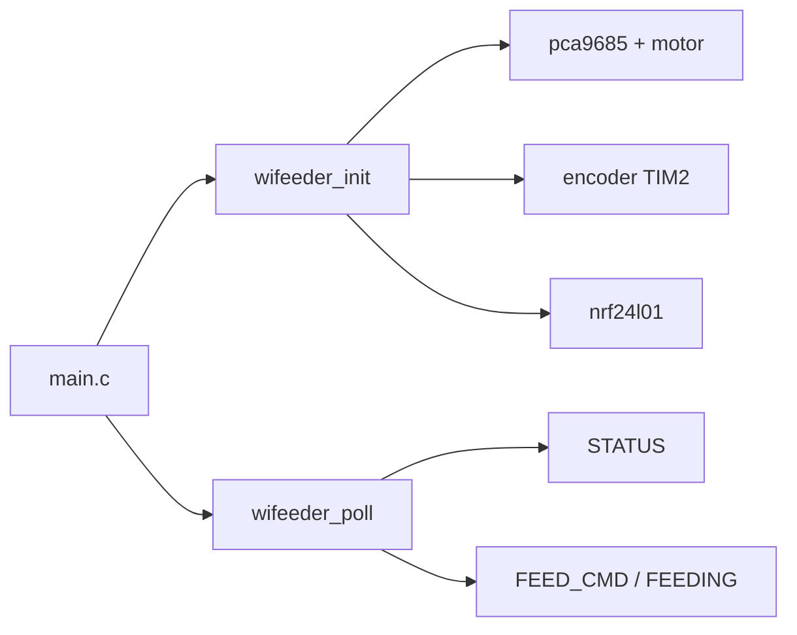
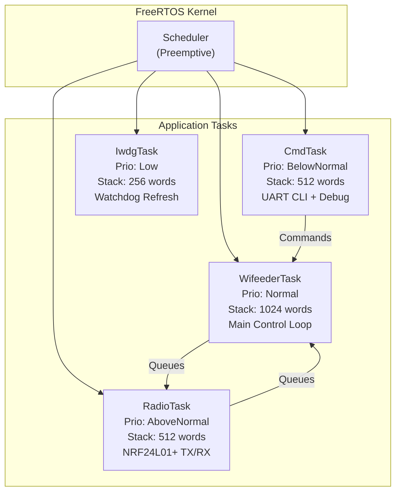
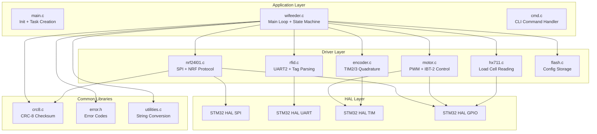
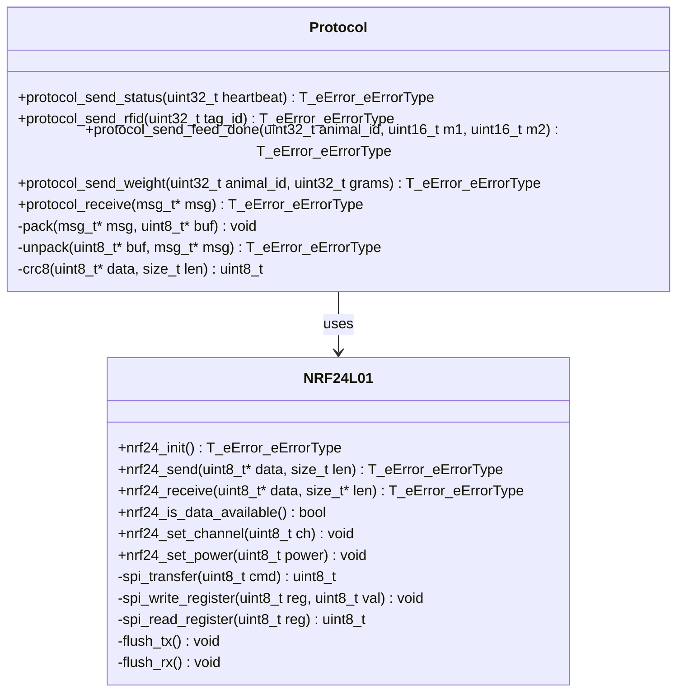
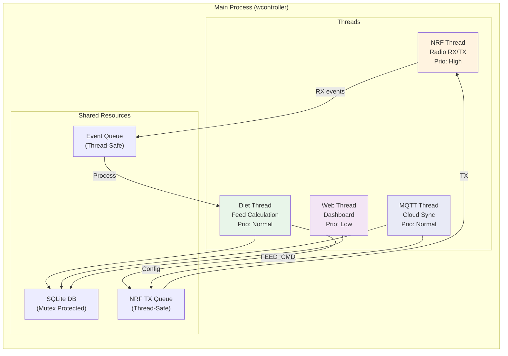
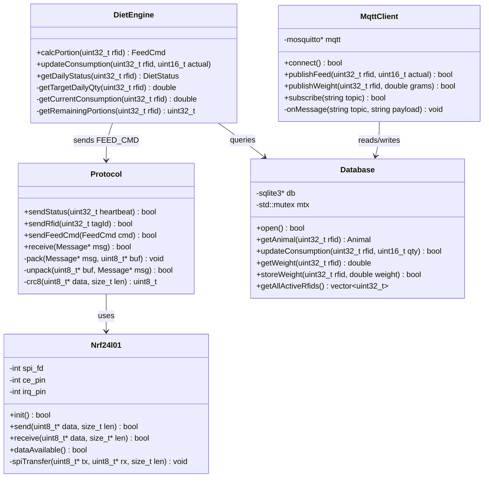
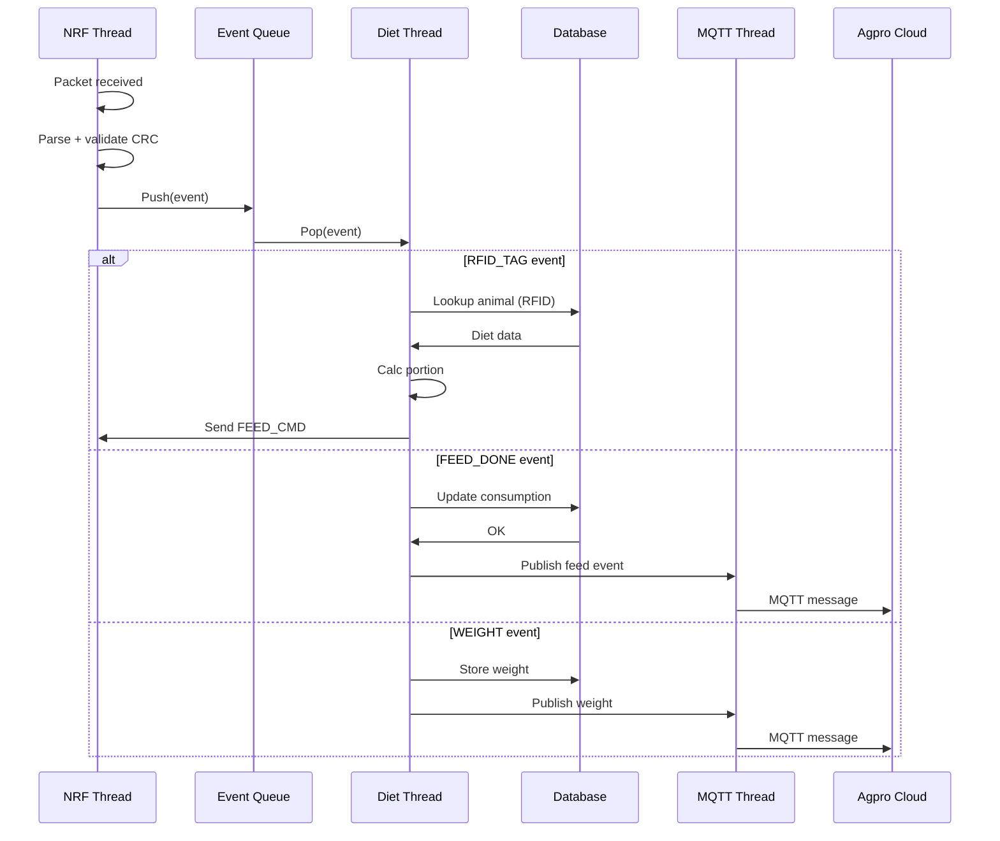
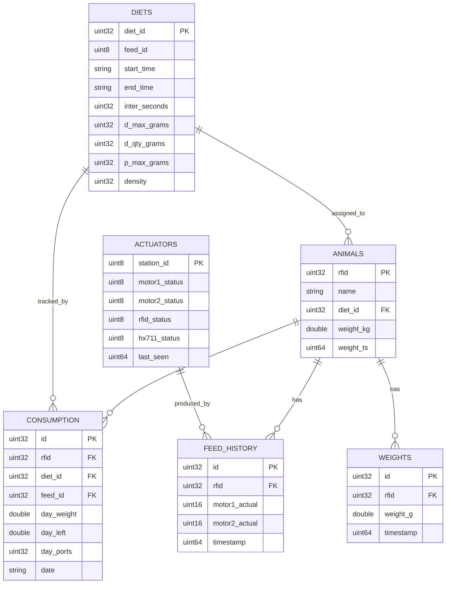
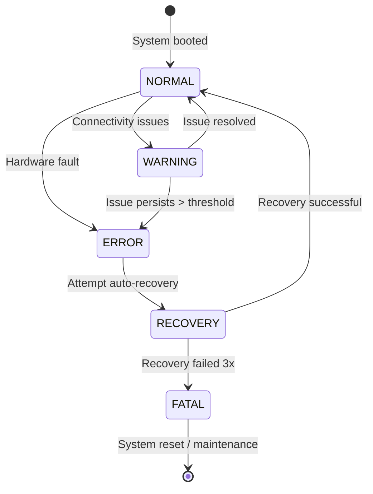

# WiFeeder v2 — Software Architecture

> **MCU (today)**: Bare-metal superloop (`wifeeder_init` / `wifeeder_poll`) — FreeRTOS vendored but **not linked** yet  
> **Motor PWM**: PCA9685 over bit-bang I2C (PB6/PB7)  
> **Host**: C++17 + CMake · diet/DB/MQTT/NRF  

---

## 1. STM32 Firmware Architecture

### 1.0 Current runtime (MVP)



FreeRTOS task split below is the **target** model, not what `CMakeLists.txt` builds today.

### 1.1 Task Hierarchy (planned)



### 1.2 Module Dependency Graph



### 1.3 NRF24L01+ Driver API



### 1.4 Timer Allocations

> **L432KC note:** This MCU has **no TIM3 / TIM4 / TIM8**. Use TIM1 + TIM16 for PWM and TIM2 for Enc1. Enc2 is soft EXTI (PA11/PA12). See [`docs/wifeeder-v2-final-plan.md`](docs/wifeeder-v2-final-plan.md) §2.

| Timer | Channel | Function | Frequency |
|-------|---------|----------|-----------|
| TIM1 | CH1 | PWM Motor 1 (PA8) | 10 kHz |
| TIM16 | CH1 | PWM Motor 2 (PB6) | 10 kHz |
| TIM2 | CH1, CH2 | Encoder 1 (PA0/PA1) | 400 PPR × 4 = 1600 cnt/rev |
| SysTick | - | FreeRTOS tick / HAL tick | 1 kHz |

### 1.5 Memory Map

```
FLASH (256 KB):
  0x0800_0000 - 0x0800_7FFF : Bootloader (32 KB)
  0x0800_8000 - 0x0800_FFFF : Application (32 KB)
  0x0801_0000 - 0x0801_7FFF : Config Pages (32 KB)
  0x0801_8000 - 0x0803_FFFF : Reserved (160 KB)

RAM (64 KB):
  0x2000_0000 - 0x2000_0FFF : Stack (4 KB)
  0x2000_1000 - 0x2000_7FFF : Heap + FreeRTOS (28 KB)
  0x2000_8000 - 0x2000_FFFF : Static Data + BSS (32 KB)
```

---

## 2. Raspberry Pi Software Architecture

### 2.1 Thread Model



### 2.2 Class Diagram



### 2.3 Event Processing Pipeline



### 2.4 Database Schema



### 2.5 Config File Format (`config.json`)

```json
{
  "station": {
    "sn": "WCN-A100-0001X",
    "device_id": 0,
    "name": "Station 1"
  },
  "nrf24": {
    "spi_device": "/dev/spidev0.0",
    "ce_pin": 25,
    "irq_pin": 24,
    "channel": 76,
    "data_rate": "1Mbps",
    "tx_power_dbm": 0
  },
  "mqtt": {
    "broker": "localhost",
    "port": 1883,
    "username": "client2",
    "password": "wifeeder@agTEK.2020_2_mqtt",
    "keep_alive": 60,
    "qos": 2,
    "topic_prefix": "WCN-A100-0001X"
  },
  "database": {
    "path": "/etc/wifeeder-v2/wifeeder.db"
  },
  "feeding": {
    "algorithm": "linear_dynamic",
    "calibration_tag": 0,
    "intervals": {
      "status_ok": 5,
      "status_disconnected": 1
    }
  }
}
```

---

## 3. Build System

### 3.1 STM32 (CubeIDE / CMake)

```cmake
# stm32/CMakeLists.txt
cmake_minimum_required(VERSION 3.22)
project(wifeeder_v2_mcu C ASM)

set(CMAKE_C_STANDARD 99)
set(CMAKE_C_STANDARD_REQUIRED ON)

add_executable(wifeeder_mcu
    Core/Src/main.c
    Core/Src/nrf24l01.c
    Core/Src/protocol.c
    Core/Src/rfid.c
    Core/Src/motor.c
    Core/Src/encoder.c
    Core/Src/hx711.c
    Core/Src/flash.c
    Core/Src/cmd.c
    Core/Src/stm32l4xx_it.c
    startup/startup_stm32l432xx.s
)

target_link_libraries(wifeeder_mcu
    STM32_HAL
    FreeRTOS
    CMSIS
    Common
)
```

### 3.2 Raspberry Pi (CMake)

```cmake
# raspberry/CMakeLists.txt
cmake_minimum_required(VERSION 3.16)
project(wifeeder_v2_host CXX)

set(CMAKE_CXX_STANDARD 20)
set(CMAKE_CXX_STANDARD_REQUIRED ON)

add_executable(wifeeder_host
    src/main.cpp
    src/nrf24l01.cpp
    src/protocol.cpp
    src/diet_engine.cpp
    src/database.cpp
    src/mqtt_client.cpp
)

target_link_libraries(wifeeder_host
    PRIVATE PkgConfig::MOSQUITTO
    PRIVATE PkgConfig::SQLITE3
    PRIVATE pthread
    PRIVATE wiringPi
)
```

---

## 4. Key Data Structures

### 4.1 Message (Both Platforms)

```c
typedef struct __attribute__((packed)) {
    uint8_t  dest_id;
    uint8_t  src_id;
    uint8_t  msg_type;
    uint8_t  seq_num;
    union {
        struct { uint32_t heartbeat; uint8_t sensors; uint8_t battery; } status;
        struct { uint32_t tag_id;   uint32_t timestamp;               } rfid_tag;
        struct { uint32_t animal_id; uint16_t motor1_revs; uint16_t motor2_revs; } feed_cmd;
        struct { uint32_t animal_id; uint16_t motor1_actual; uint16_t motor2_actual; } feed_done;
        struct { uint32_t animal_id; uint32_t weight_g;               } weight;
        struct { uint8_t  param_id;  uint32_t value;                   } config;
        struct { uint8_t  echoed_type; uint8_t status;                 } ack;
        struct { uint8_t  error_code; uint32_t details;                } error;
    } payload;
    uint8_t crc;
} T_stWifeederV2_iMessage;
```

### 4.2 NRF Stats (Debugging)

```c
typedef struct {
    uint32_t packets_sent;
    uint32_t packets_received;
    uint32_t acks_received;
    uint32_t retries;
    uint32_t crc_errors;
    uint32_t max_rt_errors;
    uint32_t sequence_gaps;
    int8_t   last_rssi;
    uint32_t uptime_ms;
} T_stNrf_iStats;
```

---

## 5. Error Handling Strategy



### Error Response Matrix

| Error | STM32 Action | RPi Action |
|-------|-------------|-----------|
| NRF TX fail (1x) | Retry app-level | Wait for next STATUS |
| NRF TX fail (3x) | Mark disconnected, 1s heartbeat | Log, alert MQTT |
| NRF TX fail (10x) | Increment fail counter | Alert MQTT, mark offline |
| RFID read fail | Retry 5x, then ignore | N/A |
| Motor stall | Stop motor, send ERROR | Log, alert MQTT |
| HX711 timeout | Send ERROR, retry next cycle | Log |
| Watchdog timeout | System reset | Log reset event |
