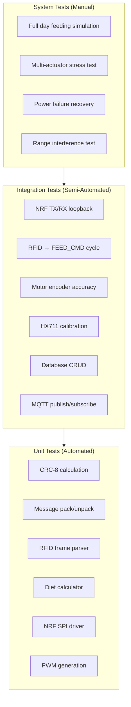
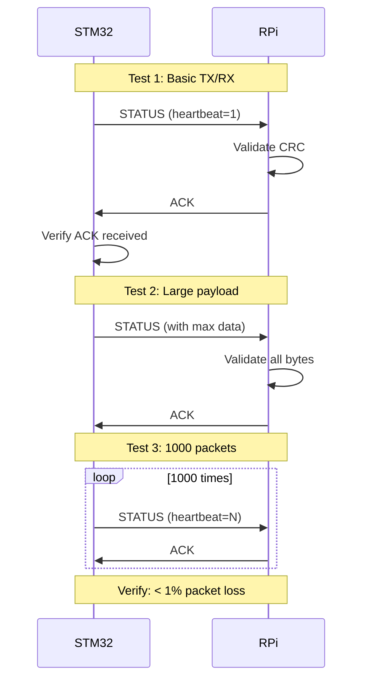
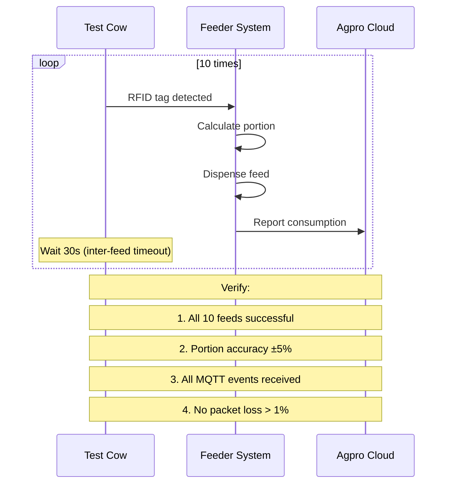
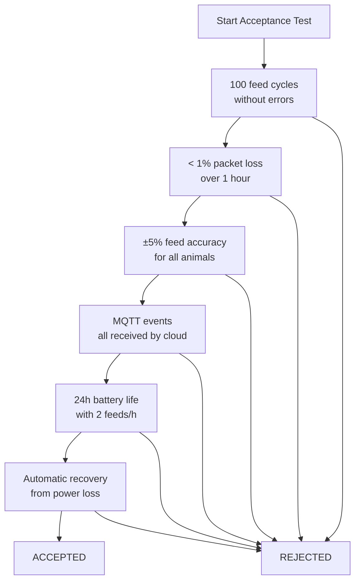

# WiFeeder v2 — Testing Plan

---

## 1. Test Pyramid



---

## 2. Unit Tests

### 2.1 CRC-8 Tests

| Test ID | Description | Input | Expected |
|---------|-------------|-------|----------|
| CRC-001 | Empty buffer | `""` | `0x00` |
| CRC-002 | Known vector | `"123456789"` | `0xF4` |
| CRC-003 | Single byte | `"\x00"` | `0x00` |
| CRC-004 | Single byte | `"\xFF"` | `0xF7` |
| CRC-005 | All message types | All msg types | Consistent |

### 2.2 Message Pack/Unpack Tests

| Test ID | Description | Action | Expected |
|---------|-------------|--------|----------|
| MSG-001 | Pack STATUS | Serialize struct | Correct bytes |
| MSG-002 | Pack RFID_TAG | Serialize struct | Correct bytes |
| MSG-003 | Pack FEED_CMD | Serialize struct | Correct bytes |
| MSG-004 | Unpack STATUS | Deserialize bytes | Correct struct |
| MSG-005 | Unpack corrupted | Invalid CRC | Return error |
| MSG-006 | Unpack wrong size | Size < 4 | Return error |

### 2.3 RFID Frame Parser

| Test ID | Description | Input | Expected |
|---------|-------------|-------|----------|
| RFID-001 | Valid frame | `"$A0112OKD199462190123456AB"` | `tag_id=19946219` |
| RFID-002 | Bad header | `"$X0112OKD199462190123456AB"` | `Failure_BadFormat` |
| RFID-003 | Bad checksum | `"$A0112OKD19946219012345600"` | `Failure_BadFormat` |
| RFID-004 | Short frame | `"$A0112OKD123"` | `Failure_BadFormat` |
| RFID-005 | Empty frame | `""` | `Failure_BadFormat` |

### 2.4 Diet Calculator

| Test ID | Description | Input | Expected |
|---------|-------------|-------|----------|
| DIET-001 | First feed of day | `dayweight=0, dayleft=3000` | `portion=p_max` |
| DIET-002 | Mid-day feed | `dayweight=1500, dayleft=1500` | `portion=375` |
| DIET-003 | Last portion | `dayleft < p_max` | `portion=dayleft` |
| DIET-004 | Daily limit hit | `dayweight >= d_max` | `portion=0` |
| DIET-005 | Outside feeding window | `time < start` | `portion=0` |
| DIET-006 | Interval too short | `time_since_last < inter` | `portion=0` |

---

## 3. Integration Tests

### 3.1 NRF Communication Test



### 3.2 RFID → Feed Cycle Test

| Step | Action | Expected |
|------|--------|----------|
| 1 | Present known RFID tag | Tag ID read correctly |
| 2 | STM32 sends RFID_TAG | RPi receives |
| 3 | RPi calculates portion | Correct motor revs |
| 4 | RPi sends FEED_CMD | STM32 receives |
| 5 | Motors activate | Both motors spin |
| 6 | Encoders count | Correct revs dispensed |
| 7 | STM32 sends FEED_DONE | RPi receives |
| 8 | Database updated | Consumption recorded |

### 3.3 Motor & Encoder Accuracy

| Test ID | Target Revs | Tolerance | Pass Criteria |
|---------|------------|-----------|---------------|
| MTR-001 | 1 rev | ±10% | 360-440 encoder counts |
| MTR-002 | 5 revs | ±10% | 1800-2200 encoder counts |
| MTR-003 | 10 revs | ±5% | 3800-4200 encoder counts |
| MTR-004 | 50 revs | ±5% | 19000-21000 encoder counts |
| MTR-005 | Start/stop rapid | No stall | Motor completes cycle |

---

## 4. System Tests

### 4.1 End-to-End Feeding Test



### 4.2 Multi-Actuator Test

| Test | Actuators | Duration | Success Criteria |
|------|-----------|----------|-----------------|
| 3 simultaneous feeds | 3 | 10 min | All complete, no collisions |
| Alternating feeds | 5 | 30 min | No cross-talk, all feed correctly |
| Max load | 6 | 1 hour | System stable, all ACKnowledged |

### 4.3 Range Test

| Distance | Environment | Expected Packet Loss |
|----------|------------|---------------------|
| 5m | Indoor (open) | < 0.1% |
| 15m | Indoor (walls) | < 1% |
| 30m | Indoor (walls) | < 5% |
| 50m | Outdoor (LOS) | < 2% |
| 100m | Outdoor (LOS) | < 5% |

### 4.4 Recovery Tests

| Test | Scenario | Expected |
|------|----------|----------|
| RPi reboot | Power cycle Pi mid-feed | STM32 detects disconnect, retries; recovers when Pi comes back |
| STM32 reboot | Power cycle STM32 mid-feed | STM32 boots clean; Pi detects reconnect |
| NRF interference | Wi-Fi channel congestion | Auto-ack handles retries; rate < 1% loss |
| Battery low | Voltage drops to 10V | STM32 sends BATTERY_LOW; Pi logs alert |
| Motor stall | Block motor mechanically | STM32 detects stall; sends ERROR; Pi alerts |

---

## 5. Performance Benchmarks

| Metric | Target | Measurement Method |
|--------|--------|-------------------|
| NRF TX success rate | > 99% | Count ACKed vs sent packets over 1h |
| Packet latency (TX→ACK) | < 5 ms | Oscilloscope on CE/IRQ pins |
| RFID read latency | < 100 ms | From tag detection to packet sent |
| Feed command latency | < 200 ms | From RPi decision to motor start |
| Motor control accuracy | ±5% | Encoder count vs target |
| CPU usage (STM32) | < 50% | FreeRTOS task statistics |
| CPU usage (RPi) | < 20% | `top` / `htop` monitoring |
| RAM usage (STM32) | < 40 KB | Linker map analysis |
| Battery life (idle) | > 24 hours | 12V 7Ah battery |

---

## 6. Test Environment Setup

### 6.1 STM32 Test Setup

```bash
# Unit tests (Unity framework)
cd stm32/tests
mkdir build && cd build
cmake ..
cmake --build .
ctest --output-on-failure

# NRF loopback test
# Connect NRF24L01+ module to STM32
# Use second NRF connected to PC via Arduino/FTDI
```

### 6.2 Raspberry Pi Test Setup

```bash
# Unit tests (Google Test)
cd raspberry/tests
mkdir build && cd build
cmake ..
cmake --build .
ctest --output-on-failure

# NRF test (with second NRF on Pi)
sudo ./test_nrf_txrx
```

### 6.3 Virtual NRF Test (No Hardware)

```bash
# Use socat to create virtual SPI devices
socat PTY,link=/tmp/nrf_stm PTY,link=/tmp/nrf_pi

# Run test with virtual devices
python3 tests/virtual_nrf_test.py
```

---

## 7. Acceptance Criteria



### Checklist

- [ ] 100 consecutive successful feed cycles
- [ ] < 1% communication failure rate
- [ ] ±5% feed quantity accuracy
- [ ] All MQTT events received by cloud
- [ ] 24-hour continuous operation without manual intervention
- [ ] Automatic recovery from power off/on
- [ ] Automatic recovery from NRF disconnection
- [ ] Motor stall detection works
- [ ] RFID error handling works
- [ ] Database integrity maintained

---

## 8. Regression Test Suite

After each firmware/software update, run:

```bash
#!/bin/bash
# scripts/run_all_tests.sh

echo "=== Unit Tests ==="
cd stm32/tests/build && ctest
cd raspberry/tests/build && ctest

echo "=== Integration Tests ==="
python3 tests/integration/test_nrf_comm.py
python3 tests/integration/test_feed_cycle.py

echo "=== System Tests ==="
# Requires hardware setup
python3 tests/system/test_full_cycle.py --cycles 10
python3 tests/system/test_multi_actuator.py --actuators 3
```
