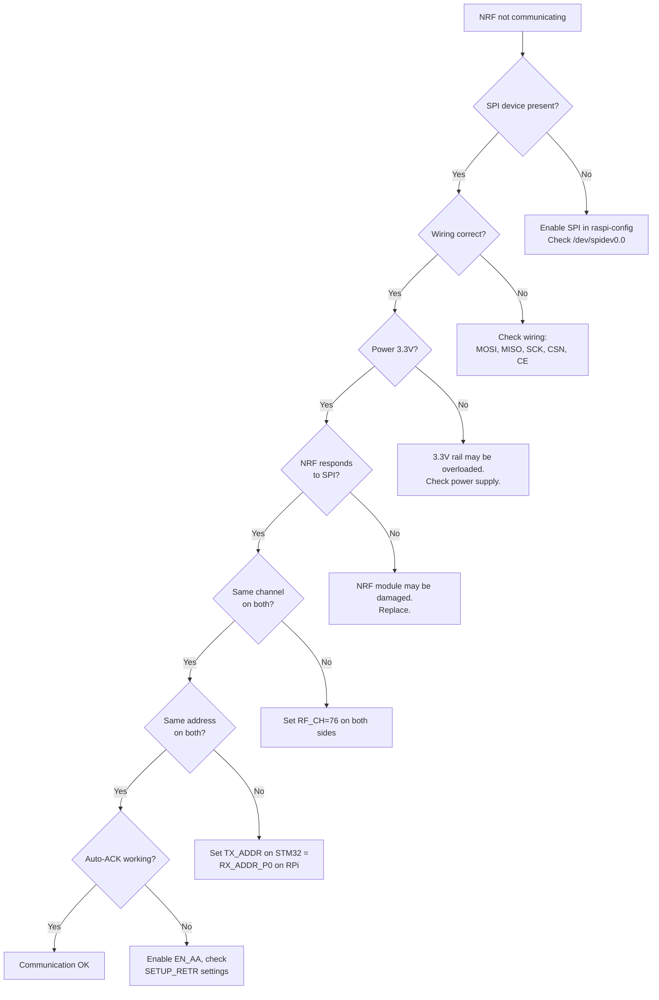
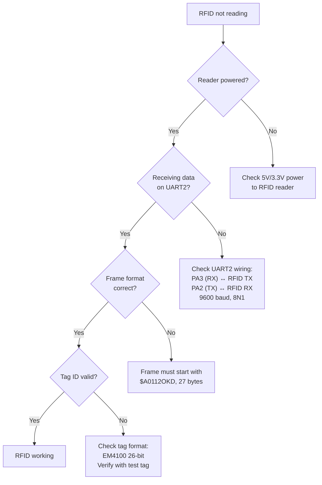
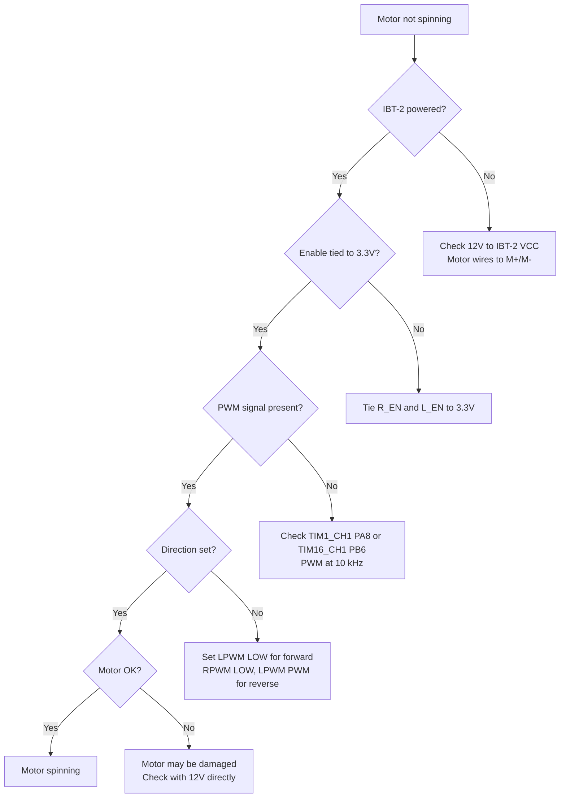

# WiFeeder v2 — Troubleshooting Guide

---

## Table of Contents

1. [NRF24L01+ Communication Issues](#nrf24l01-communication-issues)
2. [RFID Reader Issues](#rfid-reader-issues)
3. [Motor Control Issues](#motor-control-issues)
4. [Power Issues](#power-issues)
5. [Database Issues](#database-issues)
6. [MQTT Issues](#mqtt-issues)
7. [Diagnostic Commands](#diagnostic-commands)

---

## 1. NRF24L01+ Communication Issues

### 1.1 No Communication at All



### 1.2 Common NRF Errors

| Symptom | Likely Cause | Fix |
|---------|-------------|-----|
| MAX_RT (max retries) | No receiver listening | Check RPi NRF is in RX mode |
| No IRQ after TX | IRQ pin not connected | Check PB1 (STM32) or GPIO24 (RPi) |
| Intermittent packets | Interference | Change NRF channel (avoid Wi-Fi channels) |
| Short range | Antenna damaged | Replace NRF module; use PA+LNA version |
| SPI read returns 0x00 | NRF not powered | Check 3.3V power; check module orientation |

### 1.3 NRF Diagnostic Commands

```bash
# On Raspberry Pi:
cd /opt/wifeeder-v2/raspberry
sudo ./nrf_test --diagnostic

# Expected output:
# STATUS = 0x0E (RX mode, no pending interrupts)
# FIFO_STATUS = 0x11 (TX empty, RX empty)
# RF_CH = 76
# RF_SETUP = 0x06 (1Mbps, 0dBm)
# CONFIG = 0x0F (RX mode, CRC 2-byte, power up)
```

---

## 2. RFID Reader Issues

### 2.1 RFID Not Reading Tags



### 2.2 RFID Error Codes

| Error | Meaning | Fix |
|-------|---------|-----|
| `Failure_EmptyFifo` | No data from reader | Check reader power and UART wiring |
| `Failure_BadFormat` | Frame header mismatch | Reader may be different model; check format |
| `Failure_BadFormat` + checksum | Checksum error | Noise on UART line; check grounding |

### 2.3 RFID Test Command

```c
// In STM32 CLI:
rfid-test          // Scan for RFID activity
rfid-status        // Show reader health

// Expected output:
// RFID Reader: ONLINE
// Last Tag: 19946219
// Reads today: 15
// Errors today: 0
```

---

## 3. Motor Control Issues

### 3.1 Motor Not Spinning



### 3.2 Encoder Not Counting

| Symptom | Likely Cause | Fix |
|---------|-------------|-----|
| Encoder count stays 0 | Encoder not powered | Check 5V from IBT-2 to encoder VCC |
| Encoder count erratic | Noise on encoder lines | Add 100nF capacitor between A/B and GND |
| Encoder count wrong direction | Wires swapped | Swap A and B wires, or swap TIM config |
| Encoder only counts one direction | Missing B signal | Check B wire connection |

### 3.3 Motor Control Diagnostics

```c
// STM32 CLI:
m 1 1             // Test motor 1: 1 revolution
m 2 1             // Test motor 2: 1 revolution
encoder-status    // Show encoder counts

// Expected output for m 1 1:
// Start Motor 1 for 1 Revolutions
// Encoder count: 400 (or ~1600 in 4x mode)
// Motor 1 Status: 0 (OK)
```

---

## 4. Power Issues

### 4.1 Mini360 DC-DC Converter

| Symptom | Likely Cause | Fix |
|---------|-------------|-----|
| No output | Input polarity reversed | Check 12V + / - connections |
| Output voltage low | Load too high | Reduce load or use higher-rated converter |
| Output unstable | Input too low | Battery voltage > 5V minimum |
| Converter hot | Over-current | Add heatsink; use separate converter for high loads |

### 4.2 Power Diagnostics

```bash
# Measure voltages:
# Mini360 input:  12V (from battery)
# Mini360 output:  3.3V ±0.1V (multimeter)
# NRF VCC:         3.3V
# STM32 3.3V pin:  3.3V
# RFID VCC:        3.3V or 5V (depending on model)
# IBT-2 VCC:       12V
# Motor terminals: 0-12V (varies with PWM duty)
```

---

## 5. Database Issues

### 5.1 SQLite Errors

| Error | Meaning | Fix |
|-------|---------|-----|
| `unable to open database` | File not found or permissions | Check path `/etc/wifeeder-v2/wifeeder.db` |
| `database is locked` | Concurrent write access | Check mutex usage; don't open DB in multiple threads |
| `no such table` | Schema not applied | Run `schema.sql` |
| `disk I/O error` | SD card full or failing | Free space: `df -h /`; check SD health |

### 5.2 Database Repair

```bash
# Check database integrity
sqlite3 /etc/wifeeder-v2/wifeeder.db "PRAGMA integrity_check;"

# Backup database
cp /etc/wifeeder-v2/wifeeder.db /etc/wifeeder-v2/wifeeder.db.backup

# Rebuild corrupted database
sqlite3 /etc/wifeeder-v2/wifeeder.db ".recover" | sqlite3 /etc/wifeeder-v2/wifeeder_new.db
mv /etc/wifeeder-v2/wifeeder_new.db /etc/wifeeder-v2/wifeeder.db
```

---

## 6. MQTT Issues

### 6.1 MQTT Connection Problems

| Symptom | Likely Cause | Fix |
|---------|-------------|-----|
| `Connection refused` | Mosquitto not running | `sudo systemctl start mosquitto` |
| `Bad username or password` | Wrong credentials | Check `/etc/mosquitto/passwd` |
| `Connection timeout` | Firewall blocking 1883 | `sudo ufw allow 1883` |
| Messages not reaching cloud | Internet down | Check `ping agpro-server.com` |

### 6.2 MQTT Diagnostics

```bash
# Check Mosquitto status
sudo systemctl status mosquitto

# Check MQTT logs
sudo tail -f /var/log/mosquitto/mosquitto.log

# Test publish
mosquitto_pub -h localhost -u client2 -P 'wifeeder@agTEK.2020_2_mqtt' \
    -t 'WCN-A100-0001X/test' -m 'hello'

# Test subscribe (in another terminal)
mosquitto_sub -h localhost -u client2 -P 'wifeeder@agTEK.2020_2_mqtt' \
    -t 'WCN-A100-0001X/#' -v
```

---

## 7. Diagnostic Commands

### 7.1 STM32 CLI Commands

| Command | Description |
|---------|-------------|
| `help` | Show all commands |
| `get-id` | Show device ID |
| `get-type` | Show machine type |
| `nrf-status` | Show NRF24L01+ status |
| `nrf-stats` | Show NRF statistics (sent/rcvd/errors) |
| `nrf-channel <ch>` | Set NRF channel |
| `rfid-status` | Show RFID reader status |
| `rfid-test` | Test RFID reader (scan GPIOs) |
| `m <1/2> <revs>` | Test motor for N revolutions |
| `encoder-status` | Show encoder counts |
| `hx711-test` | Read HX711 raw value |
| `reset` | Software reset MCU |

### 7.2 Raspberry Pi Diagnostic Commands

```bash
# Check service
systemctl status wifeeder-v2

# View logs
journalctl -u wifeeder-v2 -f -n 100

# Check NRF
sudo /opt/wifeeder-v2/raspberry/nrf_test --diagnostic

# Check database
sqlite3 /etc/wifeeder-v2/wifeeder.db "SELECT COUNT(*) FROM feed_history;"

# Check MQTT
mosquitto_sub -h localhost -u client2 -P 'wifeeder@agTEK.2020_2_mqtt' \
    -t 'WCN-A100-0001X/#' -C 1 -W 5
```

---

## 8. Emergency Recovery

### 8.1 STM32 Not Responding

```bash
# 1. Connect ST-Link to NUCLEO
# 2. Force mass erase and reflash
openocd -f interface/stlink.cfg -f target/stm32l4x.cfg \
    -c "init" -c "halt" \
    -c "stm32l4x mass_erase 0" \
    -c "program wifeeder_mcu.bin 0x08000000 verify reset exit"
```

### 8.2 RPi Not Booting

```bash
# 1. Insert fresh SD card with Raspbian
# 2. Run setup script
sudo bash /opt/wifeeder-v2/scripts/setup_pi.sh
# 3. Restore database backup
sudo cp /backup/wifeeder.db /etc/wifeeder-v2/
```

### 8.3 Complete NRF Failure

If both NRF modules are damaged and communication is impossible:

```bash
# Fallback to UART communication (emergency mode)
# On STM32: connect debug UART (PA9/PA10) to RPi UART (GPIO14/15)
# On RPi: enable UART and run emergency protocol
sudo /opt/wifeeder-v2/raspberry/wifeeder_host --emergency-mode --serial /dev/ttyS0
```
