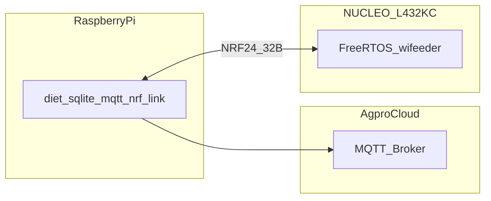
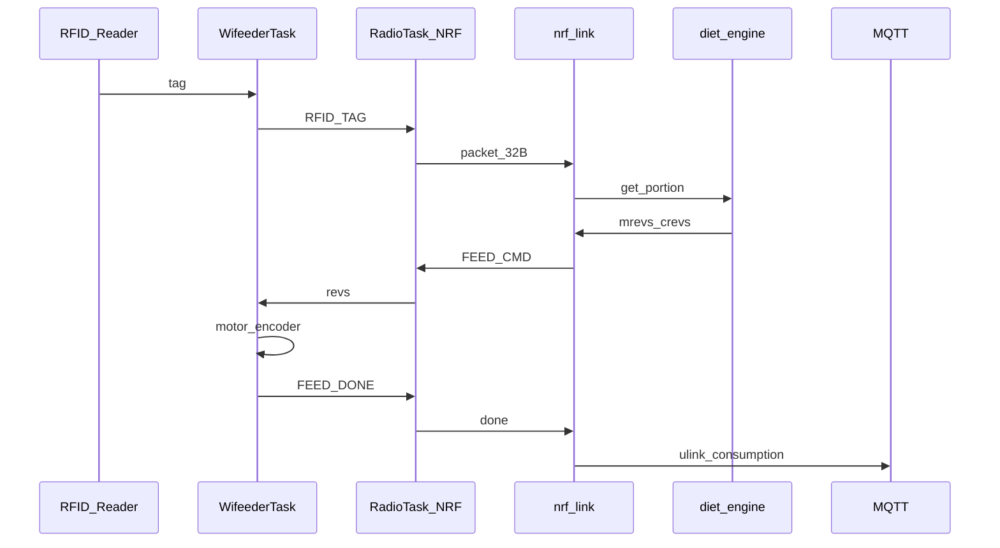
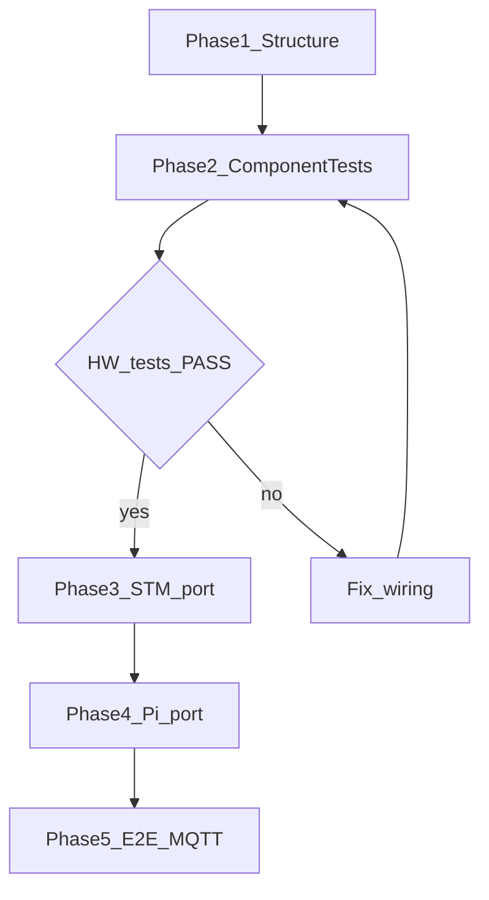

# WiFeeder v2 — Final Project Plan for AI Agent

> **Status**: Wiring MVP + PCA9685 firmware path aligned (2026-08-03)  
> **Updated**: 2026-08-03  
> **Context**: Complete rewrite of v1 CAN-based cow feeding system using NRF24L01+ wireless  
> **v1 source**: `/home/luceor/Desktop/wifeeder/` (algorithms, Host threads, MCU feed loop, Docker/CMake)  
> **v1 spec**: `/home/luceor/Desktop/wifeeder/docs/WIFEEDER_Documentation.md`

**Product intent unchanged:** RFID → Host diet calc → dispense revs → feedback → MQTT.  
**Only the link changes:** SocketCAN / walink → **NRF24L01+**.

---

## 0. System Context



Diagrams: [`diagrams/PLAN-01-system-context.mmd`](../diagrams/PLAN-01-system-context.mmd) · [`PLAN-04-feed-sequence.mmd`](../diagrams/PLAN-04-feed-sequence.mmd)

---

## 1. What Exists Already

### 1.1 wifeeder-v2 (this repo)

| Artifact | Location | Status |
|----------|----------|--------|
| Architecture docs + Mermaid | `*.md`, `diagrams/*.mmd` | Updated for PCA9685 MVP |
| Fritzing wiring pack | `wiring/` | Full + 6 block sketches |
| STM32 HAL/CMSIS (L4) | `stm32/Drivers/` | Present |
| STM32 app (superloop) | `stm32/Core/` | `wifeeder` + NRF + PCA9685 motor + Enc1 |
| FreeRTOS | `stm32/Middlewares/` | Vendored; **not linked** in CMake |
| Raspberry Pi host | `raspberry/` | C++17 NRF/diet/JSON/MQTT |
| Hardware tests 01–10 | `tests/` | Present; 04 = PCA motor |
| Docker image | `wifeeder-dev` | Working |

### 1.2 wifeeder v1 (port source — `/home/luceor/Desktop/wifeeder/`)

| Layer | Path | Status |
|-------|------|--------|
| Host (Pi) | `Host/src/main.cpp` + diet/DB/MQTT/walink | Production C++17 |
| MCU (actuator) | `MCU/app/Src/wifeeder.c` + FreeRTOS | Production on **STM32L486ZG** |
| FreeRTOS tree | `MCU/CubeMxProjects/.../FreeRTOS/` | Vendor into v2 |
| Shared CRC | `Common/` | Reuse |
| Docker/CMake | `docker/Dockerfile.dev`, `cmake/toolchain-*.cmake` | Reuse |
| Spec | `docs/WIFEEDER_Documentation.md` | Behaviors to preserve |

---

## 2. Critical Hardware — NUCLEO-L432KC Reality

### 2.1 Package limits (must not use dead pins)

STM32L432KC (UFQFPN32) / Nucleo-32 **does not have**: PB8–PB11, PC0–PC13, TIM3, TIM4.

Arduino Nano labels on this board (UM1956):

| Arduino | STM32 | Notes |
|---------|-------|-------|
| D8 | **PC15** | OSC32 — avoid |
| D9 | **PA8** | TIM1_CH1 (was mislabeled D8=PA8 in older notes) |
| D6 | PB1 | NRF MISO |
| D13 | PB3 | Onboard LED LD3 |
| A4 / A6 | PA5 / PA7 | NRF SCK / MOSI |

**Board lessons (this unit):**

1. **PA6 is shorted to GND** — never use as MISO; use **PB1**.
2. Bit-bang SPI required (PB1 has no SPI AF).
3. NRF adapter VCC often needs **5V** into AM1117 (not bare 3.3V).
4. Production CSN = **PA4**. Motor PWM is on **PCA9685** (not TIM1 on PA8).
5. Never use L486-only PLL header macros on L432 — bit positions differ.
6. **One jumper per Nucleo pin** — see `wiring/CONNECTOR_MAP.md`.

### 2.2 Locked production pin map (MVP)

| Function | Pin | Notes |
|----------|-----|-------|
| NRF SCK / MOSI / MISO | PA5 / PA7 / **PB1** | Bit-bang SPI |
| NRF CSN / CE | **PA4** / PB0 | Adapter VCC=**5V** |
| LED | PB3 | Nucleo LD3 |
| PCA9685 SCL / SDA | **PB6** / **PB7** | I2C bit-bang (D5/D4) |
| Motor1 | PCA PWM0 / PWM1 → IBT RPWM/LPWM | EN→3.3V; OE→GND |
| Encoder 1 A/B | PA0 / PA1 | TIM2 ×4; GTS06 **600 P/R** |
| RFID / HX711 / Motor2 | deferred | Drivers exist; `WIFEEDER_MVP` |
| Debug UART | PA2 | LPUART1 → ST-Link VCP |

**MVP:** PCA9685 + 1 motor + Enc1 + NRF + LED.

Authority: [`wiring/CONNECTOR_MAP.md`](../wiring/CONNECTOR_MAP.md) · [`stm32/Core/Inc/board.h`](../stm32/Core/Inc/board.h)

### 2.3 Quick reference — NRF wiring (production)

```
NRF Adapter Pin → NUCLEO-L432KC
════════════════════════════════
VCC   → 5V    (AM1117 adapter; NOT bare 3.3V unless regulated)
GND   → GND
SCK   → PA5   (A4)
MOSI  → PA7   (A6)
MISO  → PB1   (D6)   [PA6 shorted — do not use]
CSN   → PA4   (A3)
CE    → PB0   (D3)
IRQ   → not connected (PB1 used for MISO)
Channel → 76 (production); lab SI24R1 note may use 64
```

### 2.4 Quick reference — PCA9685 + IBT-2 (production MVP)

```
Nucleo D5/PB6 → PCA SCL
Nucleo D4/PB7 → PCA SDA
Buck 3V3      → PCA VCC
Buck GND      → PCA GND + OE
PCA PWM0      → IBT RPWM (Motor 1)
PCA PWM1      → IBT LPWM (Motor 1)
Buck 3V3      → IBT R_EN / L_EN
NRF 5V daisy  → IBT VCC
Battery 12V   → IBT B+ / B−
IBT M+ / M−   → GX-2 → motor
```

---

## 3. Directory Structure to Create

### 3.1 STM32 production tree

```
stm32/
├── Core/
│   ├── Inc/
│   │   ├── nrf24l01.h      # Bit-bang SPI driver API
│   │   ├── protocol.h      # 32-byte pack/unpack + CRC8
│   │   ├── crc8.h
│   │   ├── rfid.h          # Port of v1 rfid_134khz parser
│   │   ├── motor.h         # IBT-2 PWM
│   │   ├── encoder.h
│   │   ├── hx711.h
│   │   ├── flash_int.h     # Device id/type (new flash map)
│   │   ├── wifeeder.h      # Port of v1 feed loop
│   │   └── wifeeder_cmd.h  # CLI
│   └── Src/
│       ├── main.c          # FreeRTOS init + tasks
│       ├── nrf24l01.c
│       ├── protocol.c
│       ├── crc8.c
│       ├── rfid.c
│       ├── motor.c
│       ├── encoder.c
│       ├── hx711.c
│       ├── flash_int.c
│       ├── wifeeder.c
│       ├── wifeeder_cmd.c
│       └── syscalls.c
├── Middlewares/            # Vendor FreeRTOS from v1 CubeMX tree
├── Drivers/                # Keep HAL/CMSIS
├── linker/  startup/  Config/
└── CMakeLists.txt
```

### 3.2 Raspberry Pi tree

```
raspberry/
├── src/
│   ├── main.cpp            # Port Host/src/main.cpp threads
│   ├── nrf24l01.cpp / nrf_link.cpp   # Replaces walink
│   ├── protocol.cpp
│   ├── diet.cpp            # Port from v1
│   ├── animal.cpp / weight.cpp / tool.cpp
│   ├── database.cpp        # API from v1; storage → SQLite
│   ├── mqtt_client.cpp
│   ├── scale.cpp / fwmgr.cpp / cli.cpp
│   └── feeder.cpp          # DO NOT port alternate eFeeder stack
├── include/
├── config/config.json
├── CMakeLists.txt
└── README.md
```

### 3.3 Test suite

```
tests/
├── README.md
├── CMakeLists.txt
├── 01-led/ … 08-nrf-pi/    # Self-contained mains (see §6)
└── common/test_utils.c
```

Replace empty `tests/{unit,integration,system}/` with the numbered hardware suite above (keep unit tests later under `tests/unit/` for diet GTest ports).

---

## 4. v1 → v2 Port Matrix

Diagram: [`diagrams/PLAN-06-v1-port-matrix.mmd`](../diagrams/PLAN-06-v1-port-matrix.mmd)

### 4.1 Host — port from `Host/`

| v1 file | v2 action | Notes |
|---------|-----------|-------|
| `Host/src/diet.cpp` | **Port as-is** | LINEAR_FORCED + extension |
| `animal.cpp`, `weight.cpp`, `tool.cpp` | **Port** | Data model |
| `database.cpp` | **Port API; → SQLite** | v1 JSON `/etc/wifeeder-data.json` |
| `mqtt_client.cpp` + topics | **Port** | `{SN}/diet\|weight/{ulink\|dlink}/{data\|async}` |
| `main.cpp` threads | **Port topology** | `walink_d` / `wserver_link_d` / `wcontroller_d` + scale/fwmgr/cli |
| `scale.cpp`, `fwmgr.cpp`, `cli.cpp` | **Port; rebind to nrf_link** | Same msg-type demux |
| `link/walink.cpp` | **Replace** | Keep API shape (`start/stop/sendto/recv`) |
| `can.cpp`, `can_intf.c` | **Drop** | No CAN |
| `feeder.cpp` (`eFeeder_*`) | **Do not port** | Production = diet+main |

**Preserve walink-like API:**

```cpp
class nrf_link {
public:
    T_eError_eErrorType init();
    void start();
    void stop();
    T_eError_eErrorType sendto(uint32_t msg_type, void* buf, size_t len, uint8_t dest);
    T_eError_eErrorType recv(uint32_t msg_type, void* buf, size_t* len);
};
```

### 4.2 MCU — port from `MCU/`

| v1 asset | Path | v2 action |
|----------|------|-----------|
| Feeding loop | `MCU/app/Src/wifeeder.c` | Port into WifeederTask; CAN waits → NRF queues |
| Tasks | Cmd / Wifeeder / Iwdg | Reuse + add **RadioTask** |
| FreeRTOS | CubeMX Third_Party/FreeRTOS | Vendor into `stm32/Middlewares/` |
| RFID 134 kHz | `Drivers/RfId/Src/rfid_134khz.c` | Port parser; USART2/PA3 |
| HX711 math | `Drivers/Hx711/Src/hx711.c` | Port math; bit-bang PB4/PB5 |
| Encoder stall/overshoot | `Drivers/motor/gtk08.c` | Port algorithm; new pins |
| Flash id/type | `app/Src/flash_int.c` | Port pattern; **new 256 KB addresses** |
| CLI | `Middlewares/Cmd/` | Port to LPUART1 |
| CRC8 | `Common/` | Share via `crc8.c` |
| GTK08 On/Off motor | `gtk08.c` | **Rewrite** → IBT-2 PWM |
| CAN stack | — | **Drop** |
| L486 CubeMX/pins | `.ioc` | **Do not copy** |

### 4.3 Infra reuse

- Docker: `wifeeder/docker/Dockerfile.dev` → image `wifeeder-dev`
- Toolchain: `wifeeder/cmake/toolchain-arm-none-eabi.cmake`
- Finders: `FindFreeRTOS.cmake`, `FindCMSIS.cmake`, `FindSTM32HAL.cmake`
- Host GTest diet tests: port early (no HW)
- Smoke ELF checks: adapt `smoke_tests/`

---

## 5. Protocol Reconciliation

Diagram: [`diagrams/PLAN-07-protocol-map.mmd`](../diagrams/PLAN-07-protocol-map.mmd)

v1 has **two** encodings; v2 uses **one** NRF app protocol ([`PROTOCOL.md`](../PROTOCOL.md)).

| v1 CAN `T_eMsgType` | Role | v2 MsgType |
|---------------------|------|------------|
| Status (0) | Heartbeat + health | STATUS `0x01` |
| Ack (1) | Soft ACK | ACK `0x07` |
| FeedReq (2) | Tag needs diet | RFID_TAG `0x02` |
| FeedCmd (3) | Dispense revs | FEED_CMD `0x03` |
| FeedFdbk (4) | Actual revs | FEED_DONE `0x04` |
| FeedRsp (5) | Host confirms | ACK or omit (ESB) |
| WeightInd (6) | Grams | WEIGHT `0x05` |
| WeightRsp (7) | Confirm | ACK `0x07` |
| — | — | CONFIG `0x06`, ERROR `0x08` |

**Packet layout (32 B max):** `[DestID][SrcID][MsgType][Seq][Payload…][CRC-8]`  
CRC-8 poly 0x07 over bytes 0..n-1 (same spirit as v1 MCU CRC8).

**Addressing:** v1 Host CAN ID `0x01`, WA `0x02+` → DestID/SrcID + NRF pipe map. Multi-WA ≤30 still required.

**Do not port:** walink START/END 8-byte framing, `can_intf` bitfields, SocketCAN.



---

## 6. Behavioral Contracts (acceptance criteria)

From v1 spec + `Host/src/diet.cpp` / `MCU/app/Src/wifeeder.c` — **must preserve**:

### Diet / feeding
- Windows: ordinary `[start,end)`, extension `end→midnight`, pause `midnight→start`
- Params: `inter`, `d_qty`, `d_max`, `p_max`, `density`, ≤2 feeds/diet
- Algo: `FEEDING_ALGO_LINEAR_FORCED`
- Grams↔revs: `DEF_CALIBER_REF_REVS=16`, `DEF_CALIBER_REF_WEIGHT=960`
- Caliber diet ID 1: always **exactly 16 revs**
- Daily reset ~**23:50**; missed carry; underfeed WARN/ALERT (50%/20%, 60%/40%)
- Unknown RFID → uplink async, no normal dispense
- Same-tag debounce **30 s**
- Caps: ~300 animals, 20 diets, ≤30 actuators

### Timeouts / reliability
- Status every **30 s**; fail retry **1 s**; **5 fails → MCU reset**
- Feed wait: **10 × 300 ms** (app-layer on NRF)
- Motor stall ~**1–1.5 s** no pulse → stop
- Host WA offline: **5 min** without RX → publish offline
- Local DB autonomy if MQTT down
- No feed unless link OK

### Motor / encoder
- GTS06 **600 P/R**; TIM2 ×4 → **2400** counts/rev (`BOARD_ENCODER_COUNTS_PER_REV`)
- Overshoot compensate ≤16 pulses (tune on bench)
- MVP single motor (v1 motor2 unused in run path)

---

## 7. FreeRTOS Task Model

Diagram: [`diagrams/PLAN-05-freertos-tasks.mmd`](../diagrams/PLAN-05-freertos-tasks.mmd)

| Task | Priority | Role | v1 origin |
|------|----------|------|-----------|
| RadioTask | AboveNormal | NRF TX/RX + queues | New (replaces CAN poll) |
| WifeederTask | Normal | Port of `eWifeeder_eMainTask_Tsk` | `wifeeder.c` |
| CmdTask | BelowNormal | UART CLI | `Middlewares/Cmd` |
| IwdgTask | Low | Watchdog when round counter advances | `IwdgTask` |

Timers (L432 MVP): **TIM2** Encoder1, SysTick. Motor PWM = **PCA9685**. FreeRTOS later.

---

## 8. Test Program Specifications

### Test 01 — LED (`tests/01-led/`)
- Purpose: Board boots; GPIO works  
- Wiring: none (PB3)  
- Output: green LED ~2 s blink  
- Status: design ready (implement in Phase 2)

### Test 02 — UART (`tests/02-uart/`)
- Purpose: Serial on LPUART1 PA2 (VCP) or USART1 PA9 external cable  
- Clock: HSI 16 MHz for 115200  
- Output: `=== NUCLEO-L432KC UART OK ===` every 5 s

### Test 03 — NRF24L01+ (`tests/03-nrf/`)
- Purpose: Module responds to SPI  
- **Preserve** current `stm32/Core/Src/main.c` (CSN=PA8 bring-up OK)  
- Then add variant / note for production CSN=PA4  
- LED: ON 5s OFF 1s = PASS; ON 2s OFF 2s = FAIL

### Test 04 — Motor (`tests/04-motor/`)
- Purpose: PCA9685 → IBT-2 Motor1  
- Wiring: PB6/PB7 I2C → PWM0/PWM1 → RPWM/LPWM; EN→3.3V; OE→GND  
- LED: 3 blinks = PCA OK; fast blink = PCA fail  

### Test 05 — Encoder (`tests/05-encoder/`)
- Encoder A/B → PA0/PA1 (TIM2 encoder mode)

### Test 06 — RFID (`tests/06-rfid/`)
- RFID TX → PA3 (USART2_RX), 9600 8N1  
- Port frame parse from v1 `$A0112OKD` + XOR checksum

### Test 07 — HX711 (`tests/07-hx711/`)
- DOUT→**PB4**, SCK→**PB5** (not PC0/PC1)

### Test 08 — NRF on Pi (`tests/08-nrf-pi/`)
- SPI0: SCLK11 / MISO9 / MOSI10 / CE0=GPIO8; CE=GPIO25  
- TX/RX test packets with pigpio or spidev

---

## 9. Implementation Order

Diagram: [`diagrams/PLAN-02-phase-roadmap.mmd`](../diagrams/PLAN-02-phase-roadmap.mmd)



### Phase 1 — Structure
1. Delete `stm32/build/`
2. Move NRF probe → `tests/03-nrf/main.c`
3. Create `tests/01–08` + `common/` + master CMakeLists
4. Document CSN rewire PA8→PA4 for motor tests

**Exit:** Each test dir builds (even stub README-only OK for empty tests).

### Phase 2 — Component tests
5–12. Implement tests 01–08 as hardware arrives; RFID parser from v1.

**Exit:** LED/UART/NRF/Motor/Encoder/RFID PASS on bench.

### Phase 3 — Production STM firmware
13. Vendor FreeRTOS from v1 CubeMX tree  
14. `nrf24l01.c` (bit-bang) + `protocol.c` + `crc8.c`  
15. Port `wifeeder.c` loop; `motor`/`encoder`/`rfid`/`hx711`/`flash_int`  
16. Tasks: Radio / Wifeeder / Cmd / Iwdg  

**Exit:** Status heartbeat + RFID→FEED_CMD→FEED_DONE with Pi test harness.

### Phase 4 — Raspberry Pi
17. `nrf_link` replacing walink  
18. Port diet/animal/database(SQLite)/mqtt/main threads  
19. Rebind scale/fwmgr/cli  

**Exit:** Full feed cycle without cloud.

### Phase 5 — E2E
20. MQTT uplink/downlink  
21. 5 min offline + diet GTest from v1  
22. Multi-actuator pipe addressing  

**Exit:** Behavioral contracts in §6 satisfied.

---

## 10. How to Build / Flash / Serial

### Build a test
```bash
cd /home/luceor/Desktop/wifeeder-v2/tests/03-nrf
mkdir -p build && cd build
cmake .. -DCMAKE_TOOLCHAIN_FILE=/home/luceor/Desktop/wifeeder/cmake/toolchain-arm-none-eabi.cmake
cmake --build . -j$(nproc)
```

### Flash
```bash
# Mass storage
cp build/test_nrf.bin /media/luceor/NODE_L432KC/

# OpenOCD via Docker
sg docker -c 'docker run --rm --user root --privileged \
  -v /dev/bus/usb:/dev/bus/usb -v /home/luceor/Desktop/wifeeder-v2:/workspace \
  wifeeder-dev bash -c "
  openocd -f interface/stlink.cfg -f target/stm32l4x.cfg \
    -c \"init\" -c \"program /workspace/tests/03-nrf/build/test_nrf.elf verify reset exit\"
"'
```

### Serial
```bash
# VCP (LPUART1 PA2) typically /dev/ttyACM0
# External PL2303: GREEN=TX→STM RX, WHITE=RX←STM TX
sudo chmod 666 /dev/ttyUSB0
stty -F /dev/ttyUSB0 115200 raw -echo
cat /dev/ttyUSB0
```

Use `-DSTM32L486xx` for HAL compatibility on L432; `-ffunction-sections -fdata-sections` + `-Wl,--gc-sections`.

---

## 11. Risk Register

| Risk | Mitigation |
|------|------------|
| NRF module silent on SPI | STATUS=0x0E + RF_CH R/W test; 5V adapter; >10 ms power-on delay |
| PA6 shorted | Always MISO=PB1 |
| Pin starvation on L432 | MVP 1 motor; Phase 3b for M2/HX711/Enc2 |
| CSN vs Motor1 on PA8 | Production CSN=PA4 |
| Dual v1 protocols confuse ports | Map from MCU `T_eMsgType` only; drop walink framing |
| L486 flash pages invalid | New flash map for 256 KB |
| FreeRTOS missing in v2 | Copy from v1 CubeMX Third_Party |
| HARDWARE.md historically wrong | This plan + HARDWARE.md sync are authoritative |

---

## 12. File Inventory — What to Create (code phases)

| File | Type | Content |
|------|------|---------|
| `stm32/Core/Inc|Src/*` | FW | Drivers + wifeeder + protocol + FreeRTOS main |
| `stm32/Middlewares/FreeRTOS/` | Vendor | From v1 |
| `tests/01–08/*` | Tests | Standalone bring-up |
| `raspberry/src|include/*` | Host | Ported Host + nrf_link |
| `docs/wifeeder-v2-final-plan.md` | Doc | **This file** |
| `diagrams/PLAN-01` … `PLAN-07` | Diagrams | Roadmap / pins / port / protocol |

---

## 13. Related Docs

| Doc | Role after sync |
|-----|-----------------|
| [`HARDWARE.md`](../HARDWARE.md) | Locked L432KC pin map |
| [`SOFTWARE.md`](../SOFTWARE.md) | TIM1/TIM16/TIM2; FreeRTOS tasks |
| [`PROTOCOL.md`](../PROTOCOL.md) | NRF packet types |
| [`ARCHITECTURE.md`](../ARCHITECTURE.md) | System topology |
| v1 `WIFEEDER_Documentation.md` | Behavioral source of truth |
